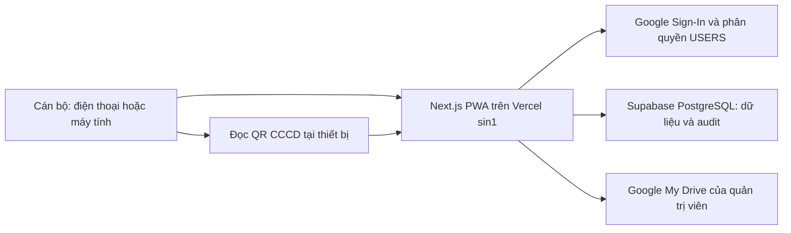

# AGENTS.md

> Dành riêng cho **Codex**. Claude Code dùng `CLAUDE.md`.
>
> **BẮT BUỘC: đọc `docs/brain/` trước khi code**, đặc biệt **Code Graph** trong
> `docs/brain/01-architecture.md` (bản đồ module — "đụng vào X ảnh hưởng đâu"; dự án hiện
> chưa có mã nguồn nên Code Graph còn trống, agent khởi tạo code phải điền lại). File
> `AGENTS.md` này vẫn là nguồn chi tiết nhất về mô hình dữ liệu, API và bảo mật —
> `docs/brain/` là bản tóm tắt/tổng hợp để đọc nhanh, không thay thế. Sau khi sửa code, bắt
> buộc thêm entry vào `docs/brain/06-ai-working-log.md`; nếu đổi kiến trúc/API/schema, cập
> nhật đồng bộ cả `docs/brain/01-architecture.md`, `docs/brain/03-decisions.md` và mục liên
> quan trong chính `AGENTS.md`/`docs/architecture.md` để tài liệu không mâu thuẫn nhau.

## 1. Dự án và nguồn chỉ dẫn

Tên dự án: **Hệ thống thu thập và kiểm tra nhanh hồ sơ đất đai Phường Phong Châu**.

Mã nội bộ: `land-ocr-180`.

Tài liệu này là chỉ dẫn kiến trúc và triển khai bắt buộc cho coding agent. Kế hoạch theo giai đoạn nằm tại `PLAN.md`. Nếu có mâu thuẫn, ưu tiên yêu cầu mới nhất của người dùng, sau đó là `AGENTS.md`, rồi `PLAN.md`.

Nguồn nghiệp vụ cần giữ lại:

- `UB - KH chiến dịch 180 ngày XD CSDL đất đai.signed.pdf`
- `Phụ lục 8.docx`

Hệ thống là công cụ thu thập và chuẩn hóa trung gian; không thay thế CSDL đất đai chuyên ngành, không tự tạo giá trị pháp lý và không tự xác nhận tính pháp lý của hồ sơ.

## 2. Phạm vi bản thử nghiệm

Hệ thống chỉ phục vụ **Phường Phong Châu**, với mười tổ dân phố cố định:

1. Hà Thạch
2. Lũng Thượng
3. Phú An
4. Phú Cường
5. Phú Điền
6. Phú Hộ
7. Phú Lợi
8. Phú Xuân
9. Phúc Lợi
10. Thống Nhất

Trong phạm vi:

- Web app/PWA dùng trên máy tính, Android và iPhone.
- Google Sign-In, allowlist người dùng và phân quyền theo vai trò.
- Tạo hồ sơ, lưu nháp, tiếp nhận và kiểm tra thủ công.
- Với mỗi cá nhân, thu một cặp ảnh CCCD gồm mặt trước và mặt sau; tối đa mười cá nhân mỗi bản kê khai.
- Từ một đến mười ảnh GCN/bìa đỏ cho mỗi hồ sơ.
- Đọc QR của CCCD trên thiết bị để gợi ý nhập liệu; QR thất bại thì nhập tay.
- Nhập thủ công thông tin GCN cơ bản: số phát hành, ngày cấp, số vào sổ, chủ sử dụng và ghi chú.
- Lưu file trên Google My Drive cá nhân, dữ liệu cấu trúc trên Supabase PostgreSQL.
- Tra cứu, dashboard theo tổ dân phố, xuất CSV và audit log.

Ngoài phạm vi bản thử nghiệm:

- OCR CCCD, Google Cloud Vision và parser/queue OCR nói chung. Ngoại lệ đã chốt: Antigravity local
  dùng Gemini 3.6 Flash chỉ đọc chữ đánh máy trên **GCN** để tạo bản nháp, cán bộ duyệt lại.
- Đối soát dân cư tự động hoặc kết nối CSDL đất đai quốc gia.
- Vercel Blob, Google Shared Drive và service account.
- Cung cấp dữ liệu cho người dân hoặc link Drive công khai.

Quy mô mục tiêu là tối đa 500 hồ sơ. Trước khi mở rộng cần đánh giá lại My Drive, Supabase compute/backup và nơi đặt backend.

## 3. Kiến trúc hiện tại



### 3.1. Công nghệ bắt buộc

- Một ứng dụng Next.js App Router + TypeScript strict, gồm frontend và API Route Handlers.
- Vercel là nơi chạy frontend/backend thử nghiệm, ưu tiên region `sin1`.
- PWA, Tailwind CSS, Zod, Google API Node client, Auth.js/Google OAuth, `@zxing/browser`, Vitest và Playwright.
- Dùng `heic2any` hoặc `libheif-js` chạy client-side để chuyển HEIC/HEIF sang JPEG trước khi upload.
- PWA là **online-only** ở bản thử nghiệm: phải báo rõ lỗi mất kết nối, không cam kết soạn nháp hoặc upload khi offline.
- Google My Drive lưu ảnh gốc/preview; Supabase PostgreSQL là kho dữ liệu có cấu trúc duy nhất.
- Tách rõ `DataRepository` (Supabase/PostgreSQL) và `StorageRepository` (Drive). Service nghiệp vụ và component frontend không gọi trực tiếp database hoặc Google API.

### 3.2. Tài khoản và OAuth

- `anmphongandn@gmail.com` là chủ sở hữu My Drive, Google Sheet, Google Cloud Project và `SYSTEM_ADMIN` đầu tiên.
- Tài khoản này không mặc định là Google Workspace Admin; đây là kiến trúc My Drive cá nhân.
- Đăng nhập cán bộ chỉ xin `openid`, `email`, `profile`.
- Kết nối kho dữ liệu xin `drive.file` với `access_type=offline`.
- Không lưu mật khẩu Google ở bất cứ đâu. Refresh token chỉ lưu trong Vercel Environment Variables phía server.
- Không dùng service account: service account không thể sở hữu file trên My Drive cá nhân.
- OAuth consent screen phải ở `In production` trước khi dùng dữ liệu thật. Trạng thái `Testing` có thể làm refresh token Drive hết hạn sau bảy ngày.
- Đăng nhập thành công chỉ cấp session; quyền dùng hệ thống do sheet `USERS` quyết định.

### 3.3. Drive và upload

```text
CSDL-DAT-DAI-PHONG-CHAU-THU-NGHIEM/
├── 00_CONFIG/
├── 01_INBOX/
├── 02_CASES/
│   └── {TDP_CODE}/{CASE_ID}/
│       ├── originals/
│       └── previews/
├── 03_EXPORTS/
└── 99_BACKUP/
```

- My Drive và file phải ở chế độ `Restricted`; không tạo link công khai.
- Không chia sẻ thư mục gốc cho cán bộ. Mọi truy cập đi qua ứng dụng và quyền trong `USERS`.
- Giữ nguyên file gốc. Tạo preview JPEG tối đa 2.5 MB để giao diện xem qua Vercel; ảnh gốc không đi qua body của Vercel Function.
- Browser kiểm tra JPEG, PNG, WebP, HEIC/HEIF; giới hạn 30 MB/file. HEIC/HEIF được chuyển sang JPEG tại thiết bị khi cần.
- Backend tạo resumable upload session; browser upload trực tiếp Drive và hiển thị tiến độ/retry.
- Không ghi URL upload session, link Drive, token, QR raw hoặc CCCD đầy đủ vào log.
- Xác minh file sau upload theo thư mục cha, metadata, dung lượng và checksum trước khi cập nhật trạng thái.
- Lưu `file_id` nội bộ bất biến, tách khỏi `drive_file_id` để chuẩn bị cho migration sang Shared Drive về sau.
- Scope `drive.file` chỉ nhìn thấy file/thư mục do OAuth client của ứng dụng tạo. Bootstrap CLI phải tạo cây thư mục gốc bằng chính OAuth client production; không dùng thư mục tạo thủ công qua Drive UI.

### 3.4. QR CCCD

- Dùng `@zxing/browser` hoàn toàn phía client; đọc từ ảnh CCCD đã tải và thử xoay 0/90/180/270 độ.
- Hai ô tải CCCD mặt trước/mặt sau nằm đầu phần thông tin cá nhân; ảnh mặt sau đồng thời dùng để
  đọc QR. Không yêu cầu người dân chụp/tải CCCD lần thứ hai chỉ để quét QR.
- Chỉ chấp nhận CCCD gồm 12 chữ số và ngày hợp lệ.
- QR chỉ là dữ liệu gợi ý. Cán bộ phải xem/xác nhận; QR không được ghi đè dữ liệu đã sửa thủ công.
- Không lưu payload QR thô. Chỉ lưu dữ liệu đã tách, hash payload, phiên bản decoder/parser, trạng thái và người xác nhận.
- Không đọc được QR không được ngăn việc lưu nháp hoặc nhập thủ công.

## 4. Mô hình dữ liệu và quy tắc nghiệp vụ

### 4.1. Supabase PostgreSQL

Tạo các bảng sau (tên vật lý dùng `snake_case` trong migration SQL):

- `CASES`: case ID, tổ dân phố, trạng thái, người tiếp nhận, thời gian, ghi chú, version, Drive folder ID.
- `CERTIFICATES`: số phát hành, ngày cấp, số vào sổ và thông tin GCN nhập tay.
- `OWNERS`: họ tên, CCCD, ngày sinh, giới tính, địa chỉ và nguồn `QR`/`MANUAL`.
- `FILES`: `file_id`, `case_id`, `owner_id`, document type, biến thể `ORIGINAL`/`PREVIEW`, Drive ID, MIME, dung lượng, checksum, trạng thái.
- `IDENTITY_QR_SCANS`: dữ liệu QR đã tách, `owner_id`, trạng thái, hash payload, phiên bản parser/decoder, người xác nhận.
- `USERS`, `REFERENCE_DATA`, `AUDIT_LOGS`, `ID_RESERVATIONS`, `REQUEST_LOG`, `SEARCH_INDEX`.
- Khu vực tra cứu/đối chiếu bổ sung các bảng append-only: `PUBLIC_STATUS_EVENTS`,
  `PUBLIC_SUPPLEMENT_REQUESTS`, `PUBLIC_SUPPLEMENT_ITEMS`, `EXISTING_CERTIFICATES`,
  `EXISTING_CERTIFICATE_OWNERS`, `PUBLIC_EXISTING_RECORD_LINKS`, `EXISTING_IMPORT_RUNS` và
  `PUBLIC_LOOKUP_INDEX` (256 bucket HMAC).
- Tạo sẵn `PARCELS`, `ASSETS`, `OCR_FIELDS` để tương thích nâng cấp nhưng không đưa vào quy trình hiện tại.

Không xóa bảng/cột hoặc dữ liệu đã dùng. Nếu thay đổi schema phải có migration, cập nhật tài liệu và bảo toàn dữ liệu cũ.

### 4.2. Mã định danh và idempotency

- Case ID: `PHONGCHAU-{NAM}-{SO_THU_TU_6_CHU_SO}`, ví dụ `PHONGCHAU-2026-000001`; năm phải tính theo `Asia/Ho_Chi_Minh`.
- `ID_RESERVATIONS` append-only. Số thứ tự nguyên tử cấp theo năm qua `CASE_COUNTERS` (PostgreSQL `ON CONFLICT (year) DO UPDATE SET last_sequence = case_counters.last_sequence + 1 RETURNING last_sequence`), đảm bảo không trùng số khi retry hoặc xử lý song song. (Mô tả cũ về `updatedRange` thuộc thời Google Sheets — đã thay bằng counter PostgreSQL trong Supabase).
- Mọi API ghi yêu cầu `idempotency_key` và `request_id`. `REQUEST_LOG` lưu key, kết quả đã cache và timestamp tối thiểu 24 giờ để trả đúng kết quả cho request lặp.
- Riêng `POST /api/public/submissions`, trình duyệt gửi UUID v4 trong header `idempotency-key`.
  Server namespace key bằng `PUBLIC_CREATE:`, dùng HMAC để suy ra ổn định `submission_id`, mã tiếp
  nhận và mã bí mật, nhưng `REQUEST_LOG` tuyệt đối không lưu mã bí mật rõ. Dòng
  `PUBLIC_SUBMISSIONS` và dòng `REQUEST_LOG` phải được ghi trong cùng một PostgreSQL transaction để retry
  sau khi mất response không tạo nháp mới.
- Bản ghi chỉnh sửa có `version`; PATCH yêu cầu version hiện tại và update nguyên tử bằng `WHERE version = expectedVersion`, không khớp trả `409 VERSION_CONFLICT`.
- `CLAIM`, `REQUEST_SUPPLEMENT` và `REJECT` phải ghi transition, yêu cầu bổ sung (nếu có), audit, timeline và `REQUEST_LOG` trong cùng một PostgreSQL transaction. Lặp cùng key/payload trả lại kết quả đã cache; dùng lại key cho payload khác trả `409 IDEMPOTENCY_CONFLICT`.
- Đặt lại mã bí mật phải sinh ổn định theo idempotency key, không lưu mã rõ trong `REQUEST_LOG`, và chỉ cập nhật cột truy cập (`access_code_hash`, sai/khóa, `updated_at`, `access_version`) — không ghi đè `draft_json` hay tăng `version` nghiệp vụ.
- Import GCN cũ chỉ khớp/lưu HMAC CCCD; ngày sinh không là điều kiện hợp lệ và không được chép vào `EXISTING_*`. Backfill dùng append-only, dòng cuối cùng theo `existing_record_id` là trạng thái hiệu lực.
- Không tách một mutation nghiệp vụ thành nhiều transaction. Gộp bản ghi nghiệp vụ, audit, timeline và chỉ mục liên quan trong một PostgreSQL transaction; cache đọc ngắn hạn phải invalidation khi ghi.
- Xóa ảnh GCN là soft-delete (`DELETED`) và không xóa file Drive. CCCD không được xóa trắng: upload/xác minh ảnh mới trước, sau đó chuyển ảnh cũ sang `REPLACED`.
- Thứ tự và nhãn trang ảnh GCN của biểu mẫu người dân lưu tại `draft_json.certificateFileMetadata`, tham chiếu bằng `file_id`; trạng thái file và Drive ID chỉ lấy từ `PUBLIC_FILES`.
- Khi thay ảnh CCCD hoặc GCN, phải xác minh ảnh mới trước rồi mới chuyển ảnh cũ sang `REPLACED`; không xóa vật lý file Drive.

### 4.3. Trạng thái hồ sơ

Dùng enum cố định, không dùng chuỗi tùy ý. Luồng MVP:

```text
DRAFT → UPLOADED → PENDING_REVIEW → VERIFIED
                     └→ NEEDS_MORE_DOCUMENTS → UPLOADED
VERIFIED → ARCHIVED (SYSTEM_ADMIN hoặc WARD_ADMIN)
```

Khu vực công khai còn có `SUBMITTED`, `UNDER_REVIEW`, `NEEDS_SUPPLEMENT`, `RESUBMITTED`,
`ACCEPTING`, `ACCEPTED`, `NO_ACTION_REQUIRED`, `REJECTED`, `EXPIRED`. `NO_ACTION_REQUIRED` chỉ dùng
khi định danh khớp bản ghi GCN đã xác minh và người nộp xác nhận không còn GCN mới.

- `DRAFT`: đã tạo nhưng chưa đủ ảnh bắt buộc.
- `UPLOADED`: có đủ hai mặt CCCD cho từng cá nhân và ít nhất một ảnh GCN.
- `PENDING_REVIEW`: chờ kiểm tra/hoàn thiện dữ liệu.
- `NEEDS_MORE_DOCUMENTS`: cần bổ sung ảnh hoặc thông tin.
- `VERIFIED`: cán bộ có thẩm quyền xác nhận.
- `ARCHIVED`: hồ sơ bị lưu trữ; không xóa dữ liệu.

### 4.4. Phân quyền

Giữ enum vai trò:

```ts
export enum UserRole {
  SYSTEM_ADMIN = "SYSTEM_ADMIN",
  WARD_ADMIN = "WARD_ADMIN",
  INTAKE_OFFICER = "INTAKE_OFFICER",
  REVIEW_OFFICER = "REVIEW_OFFICER",
  POPULATION_MATCH_OFFICER = "POPULATION_MATCH_OFFICER",
  REPORT_VIEWER = "REPORT_VIEWER",
  AUDITOR = "AUDITOR",
}
```

- `SYSTEM_ADMIN`: cấu hình, người dùng, tích hợp và toàn bộ dữ liệu.
- `WARD_ADMIN`: quản lý hồ sơ của Phường Phong Châu.
- `INTAKE_OFFICER`: tạo hồ sơ, upload và xem hồ sơ được phân công.
- `REVIEW_OFFICER`: sửa/kiểm tra/xác nhận hồ sơ.
- `REPORT_VIEWER`: xem dashboard và xuất dữ liệu trong phạm vi được cấp.
- `AUDITOR`: xem audit log, không sửa dữ liệu.
- `POPULATION_MATCH_OFFICER` được giữ cho nâng cấp, chưa có UI/luồng đối soát tự động.

Nguyên tắc mặc định từ chối và chỉ cấp quyền tối thiểu.

## 5. API bắt buộc

```text
POST/GET /api/cases
GET/PATCH /api/cases/:caseId
POST /api/cases/:caseId/uploads/initiate
POST /api/cases/:caseId/uploads/complete
DELETE /api/cases/:caseId/files/:fileId
POST /api/cases/:caseId/qr/confirm
POST /api/cases/:caseId/request-more-documents
POST /api/cases/:caseId/verify
POST /api/submissions/:submissionId/accept
GET /api/dashboard/summary
POST /api/exports
GET/POST/PATCH /api/users
GET /api/health/google
GET /api/health/database
GET /api/security/csrf
POST /api/public/submissions
POST /api/public/submissions/recover
GET/PATCH /api/public/submissions/current
GET/DELETE /api/public/submissions/current/files/:fileId
POST /api/public/submissions/current/existing-records/check
POST /api/public/submissions/current/existing-records/link
POST /api/public/submissions/current/no-action
POST /api/public/submissions/current/uploads/initiate
POST /api/public/submissions/current/uploads/complete
POST /api/public/submissions/current/submit
GET /api/submissions
GET /api/submissions/:submissionId
POST /api/submissions/:submissionId/action
POST /api/submissions/:submissionId/reset-access-secret
GET /api/submissions/:submissionId/files/:fileId
GET /api/submissions/:submissionId/ai-draft
POST /api/submissions/:submissionId/ai-draft/apply
GET /api/ai/jobs/ready
POST /api/ai/jobs/claim
POST /api/ai/results
```

Mọi API lỗi phải trả:

```json
{
  "error": {
    "code": "ACCESS_DENIED",
    "message": "Bạn không có quyền thực hiện thao tác này.",
    "requestId": "req_...",
    "details": null
  }
}
```

Không trả stack trace, token, Drive ID/link hoặc dữ liệu nhận dạng cá nhân đầy đủ.

`GET /api/security/csrf` chỉ cấp token ngắn hạn cho session và allowlist hợp lệ. Mọi API write
phải kiểm tra header `x-csrf-token`, `idempotency-key` và quyền ở server Node; không dựa vào
role lưu trong JWT vì tài khoản vừa bị khóa phải mất quyền ngay.

`POST /api/submissions/:submissionId/accept` là điểm vào saga tiếp nhận từ khu vực công khai:
chỉ `REVIEW_OFFICER`, `WARD_ADMIN` hoặc `SYSTEM_ADMIN` sau khi nhận xử lý mới gọi được. Saga phải
ghi checkpoint `accept_step` theo thứ tự reserve Case ID → tạo folder → di chuyển file → ghi dữ
liệu chính thức → hoàn tất; retry dùng cùng `idempotency_key` không được sinh CASE/file trùng.
Route bị khóa bằng cờ `OFFICIAL_ACCEPTANCE_ENABLED` (`src/modules/submissions/acceptance.ts`,
mặc định `false`) — độc lập với `REFERENCE_IS_PLACEHOLDER` (cờ đó chỉ nói nhãn danh mục xuất PL3
đã chốt, không phải đã đủ điều kiện ghi dữ liệu thật). Chỉ đảo `true` sau khi hoàn thành gác cổng
ở `docs/brain/04-current-tasks.md`.

## 6. Bảo mật và vận hành

- HTTPS, secure cookie (`HttpOnly`, `Secure`, `SameSite`), OAuth state/PKCE, CSRF cho mọi API write, rate limit và security headers là bắt buộc. Các biện pháp session/CSRF phải có từ M2, không chờ đến M5.
- Không commit `.env`, token, Google OAuth client secret, ảnh CCCD/GCN thật hoặc fixture chứa dữ liệu thật.
- CCCD trong danh sách, log và thông báo hiển thị dạng `0123••••8901`.
- Dùng HMAC với secret phía server cho chỉ mục tra cứu CCCD; không đưa CCCD đầy đủ vào technical log.
- Mọi API write, xem file nhạy cảm, xác nhận, export và thay đổi quyền phải ghi `AUDIT_LOGS` append-only.
- File export lưu trong `03_EXPORTS` và phải ghi nhận người tạo/thời gian/lọc dữ liệu.
- Vercel Cron tạo snapshot Drive hằng ngày trong `99_BACKUP`, nhưng đây chỉ là copy trong cùng Gmail gốc. Phải dùng backup/PITR phù hợp của Supabase và tạo `pg_dump` mã hóa định kỳ ở nơi tách biệt; snapshot Drive trong cùng Gmail không phải backup độc lập.
- Trước pilot dữ liệu thật phải chốt và ghi nhận cơ sở pháp lý thu thập CCCD, thời hạn lưu trữ và quy trình tiếp nhận yêu cầu xóa/chỉnh sửa dữ liệu cá nhân.
- Phải có health check riêng cho Supabase/schema và cho OAuth Drive, token refresh, Drive root folder, lỗi/quota Google.

Biến môi trường:

```env
APP_BASE_URL=
AUTH_SECRET=
AUTH_GOOGLE_CLIENT_ID=
AUTH_GOOGLE_CLIENT_SECRET=
GOOGLE_DRIVE_CLIENT_ID=
GOOGLE_DRIVE_CLIENT_SECRET=
GOOGLE_DRIVE_REFRESH_TOKEN=
GOOGLE_MY_DRIVE_ROOT_FOLDER_ID=
SUPABASE_DATABASE_URL=
# Chỉ dùng trong migration legacy, không cần ở runtime:
GOOGLE_SHEETS_SPREADSHEET_ID=
SYSTEM_ADMIN_EMAIL=anmphongandn@gmail.com
DATA_HASH_PEPPER=
MAX_UPLOAD_MB=30
VERCEL_REGION=sin1
AI_EXTRACTION_ENABLED=false
AI_WORKER_API_KEY=
```

Không dùng `GOOGLE_SERVICE_ACCOUNT_JSON`, `GOOGLE_SHARED_DRIVE_ID`, `GOOGLE_VISION_PROJECT_ID` hoặc `TEMP_FILE_DIR` trong bản thử nghiệm.

### 6.1 Antigravity local station và AI draft GCN

- Web app không gọi Gemini. Antigravity chạy trên máy quản trị, dùng `gemini-3.6-flash`, poll job và
  trả JSON qua API worker có `AI_WORKER_API_KEY`.
- Job chỉ chứa `PUBLIC_FILES.document_type = 'CERTIFICATE'`, checksum và manifest; không có CCCD,
  QR raw, Drive link/ID hoặc quyền ghi database/Drive. Không tạo bản sao GCN trong thư mục AI.
- Server revalidate từng file manifest tại lúc claim: cùng submission, `CERTIFICATE`, `ORIGINAL`,
  `UPLOADED`, tên file và checksum. Thiếu/sai một file làm job `STALE`, không trả manifest.
- Claim/result đều bắt buộc `workerInstanceId`, `idempotency-key` và lease còn hạn. Job `PROCESSING`
  hết lease được thu hồi nguyên tử; kết quả chỉ do worker đang giữ lease gửi được. `AI_WORKER_API_KEY`
  tối thiểu 32 ký tự khi `AI_EXTRACTION_ENABLED=true`.
- Server chặn toàn bộ JSON AI có chuỗi giống CCCD trước khi lưu `raw_json`/`normalized_json`; cảnh báo
  không được chứa lại giá trị đã chặn.
- Trường AI `CLEAR` bắt buộc có evidence; `fileId` phải thuộc manifest GCN đã join/revalidate. Kết quả
  cũ thiếu/sai evidence không được nạp nháp. Cả nhánh `STALE` phải ghi cache `REQUEST_LOG` trong cùng
  transaction để replay cùng idempotency key trả đúng `409` cũ.
- Máy trạm đang dùng tài khoản quản trị có nhãn rủi ro `ADMIN_BROAD_ACCESS`: `agent/AGENTS.md` và
  manifest chỉ là giới hạn quy trình, không được mô tả là rào chắn quyền tuyệt đối với CCCD.
- AI chỉ trả `CLEAR`, `CHECK`, `MANUAL_REQUIRED` cho số phát hành, ngày cấp, số vào sổ cùng bằng
  chứng. Ảnh mờ/chữ viết tay phải để giá trị `null`, không suy đoán và không kết luận pháp lý.
- Cán bộ chỉ có thể “Nạp nháp AI”: hệ thống điền trường `CLEAR` đang trống; không ghi đè giá trị
  hiện có, không xác nhận hồ sơ và mọi lần nạp/ghi đè phải audit.
- Địa chỉ thường trú sửa bình thường. Sửa họ tên/CCCD/ngày sinh/giới tính sau `QR_CONFIRMED` cần lý
  do, lưu audit và chuyển `QR_OVERRIDE_PENDING_REVIEW`; QR đã tách không bị xóa.

## 7. Kiểm thử và Definition of Done

### 7.1. Kiểm thử tối thiểu

- Unit test: parser QR, chuẩn hóa CCCD/ngày, che/HMAC CCCD, case ID, transition, phân quyền và version conflict.
- Integration test: PostgreSQL transaction/constraint, refresh token, Drive folders, resumable upload, retry, idempotency và lỗi từng phần.
- E2E: tạo hồ sơ, upload cặp CCCD cho từng cá nhân (tối đa 10 người) và nhiều GCN, QR thành công/thất bại, sửa dữ liệu, verify, tìm kiếm, dashboard, export và audit log.
- Thử nghiệm Android Chrome, iPhone Safari, Wi-Fi và 4G yếu.
- Chỉ dùng dữ liệu giả/ẩn danh cho test tự động và môi trường Preview.

### 7.2. Definition of Done

Một hạng mục hoàn thành khi:

- Code chạy được, TypeScript strict, có validation và xử lý lỗi.
- Có kiểm tra quyền và audit log cho thao tác write/nhạy cảm.
- Không lộ PII, token, QR raw hoặc link Drive trong log.
- Có test phù hợp và tài liệu liên quan được cập nhật.
- Không tạo case/file trùng khi upload hoặc gửi lại request.
- Không thể tải hai ảnh cùng một mặt CCCD của cùng người nếu chưa thực hiện thao tác thay ảnh; ảnh thay được xác minh trước khi ảnh cũ chuyển `REPLACED`.
- Ảnh gốc không đi qua body của Vercel Function và không có link Drive công khai.
- Email ngoài `USERS` bị từ chối dù đăng nhập Google thành công.
- QR thất bại không làm mất hồ sơ.

## 8. Nâng cấp sau thử nghiệm

Chỉ thực hiện sau khi MVP ổn định:

- Chuyển sang Google Workspace Shared Drive hoặc kho lưu trữ của cơ quan.
- Migration sao chép file, cập nhật `drive_file_id`, giữ nguyên `file_id` và `case_id`, đối chiếu checksum/audit theo lô.
- Bổ sung OCR Google Vision và lưu raw OCR JSON, parser versioning, queue và retry.
- Bổ sung dữ liệu thửa đất/tài sản, bộ 15 rồi 50 nhóm trường nghiệp vụ.
- Tăng Supabase compute/pooling hoặc tách read workload khi quy mô/đồng thời vượt cấu hình hiện tại.
- Bổ sung tích hợp đối soát dân cư hoặc hệ thống đất đai khi có thẩm quyền pháp lý và kênh kỹ thuật chính thức.

## 9. Quy tắc làm việc cho coding agent

1. Đọc toàn bộ `AGENTS.md`, sau đó đọc `PLAN.md` trước khi thay đổi code/kiến trúc.
2. Kiểm tra repository và dữ liệu hiện có; không tự ý thêm database hoặc cloud storage ngoài kiến trúc đã chốt.
3. Dùng TypeScript strict, tránh `any`; mọi thao tác ngoài phải timeout và xử lý lỗi.
4. Không gọi Google API trực tiếp từ frontend component hoặc business service.
5. Không đưa secret hay dữ liệu thật vào source, fixture, log hoặc ảnh chụp màn hình.
6. Không xóa bảng/cột/file dữ liệu đang dùng. Mọi thay đổi schema phải có migration và cập nhật tài liệu.
7. Với mỗi hạng mục hoàn thành, báo cáo file thay đổi, chức năng, test đã chạy, hạn chế, biến môi trường mới và thao tác quản trị cần thiết.
