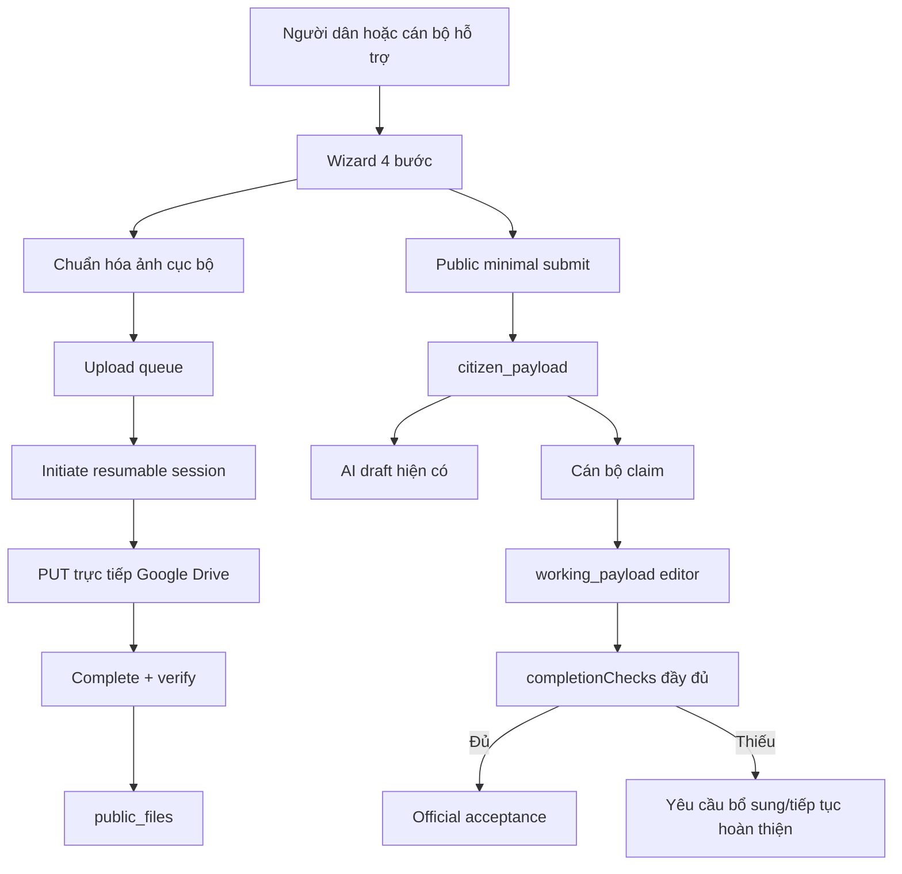

# KẾ HOẠCH THI CÔNG CHI TIẾT CHO CLAUDE CODE  
## Tối giản luồng kê khai công khai, tăng tốc tải ảnh Google Drive và bổ sung chế độ cán bộ hỗ trợ

**Dự án:** CAP Phong Châu — Hệ thống thu thập, kiểm tra hồ sơ đất đai  
**Nguồn mã đã rà soát:** `capphongchau-main.zip` do người dùng cung cấp ngày 28/07/2026  
**Mốc mã nguồn trong tệp ZIP:** không có thư mục `.git`, vì vậy Claude phải tự xác định commit/nhánh thật trong máy làm việc trước khi sửa  
**Trạng thái tài liệu:** Đã chốt chủ trương nghiệp vụ, dùng làm đầu bài thi công  
**Mức ưu tiên:** P0 — trải nghiệm người dùng và tốc độ tải ảnh  
**Agent thực hiện:** Claude Code  
**Nguyên tắc:** sửa theo từng phase, mỗi phase có test, commit độc lập, có thể rollback

---

# 0. PROMPT ĐIỀU HÀNH DÀNH CHO CLAUDE CODE

> Claude Code phải đọc toàn bộ tệp này trước khi sửa mã nguồn. Đây là đặc tả thi công, không phải tài liệu tham khảo tùy chọn.

## 0.1. Mục tiêu bắt buộc

Thi công phiên bản **Public Intake V2** với các mục tiêu:

1. Giảm luồng kê khai công khai từ 7 bước xuống 4 bước.
2. Người dân chỉ phải cung cấp dữ liệu tối thiểu:
   - số điện thoại liên hệ;
   - tên chủ sử dụng;
   - ảnh CCCD mặt trước, mặt sau đối với cá nhân;
   - ít nhất một ảnh Giấy chứng nhận;
   - các thông tin số tờ, số thửa, ký hiệu loại đất chỉ khuyến khích nhập, không chặn gửi nếu bỏ trống.
3. Không yêu cầu người dân hoàn thiện dữ liệu PL3 chuyên sâu.
4. Không hiển thị bước tài sản trong cổng công khai.
5. Giữ nguyên mô hình dữ liệu đầy đủ và khả năng cán bộ hoàn thiện hồ sơ ở lớp `working_payload`.
6. Không làm suy yếu gác cổng tiếp nhận chính thức: hồ sơ chỉ được tiếp nhận chính thức khi đã đủ toàn bộ dữ liệu nghiệp vụ theo `completionChecks`.
7. Tăng tốc tải ảnh bằng cách:
   - đo thời gian từng công đoạn;
   - chuẩn hóa ảnh lớn ở thiết bị trước khi truyền;
   - không lưu nháp thừa trước mỗi ảnh;
   - tải tối đa 2 ảnh GCN đồng thời;
   - hiển thị tiến độ thật;
   - không khóa toàn bộ wizard trong lúc ảnh đang tải.
8. Sau khi gửi thành công:
   - hiển thị thông báo hoàn thành rõ ràng giữa màn hình;
   - giữ mã tiếp nhận để người dùng sao chép;
   - có nút tạo kê khai mới;
   - không tự làm mất mã tiếp nhận ngay lập tức.
9. Bổ sung **chế độ cán bộ hỗ trợ kê khai** trong cùng PWA; không xây ứng dụng native riêng ở giai đoạn này.
10. Trong quản trị phải hiển thị tên cán bộ tiếp nhận, không chỉ email.

## 0.2. Cách làm bắt buộc

Claude phải:

1. Đọc:
   - `CLAUDE.md`;
   - `AGENTS.md`;
   - toàn bộ `docs/brain/*.md`;
   - tệp kế hoạch này;
   - các migration hiện có;
   - các test liên quan.
2. Xác định repo, nhánh và working tree thật bằng:
   ```bash
   git status --short
   git branch --show-current
   git rev-parse HEAD
   git remote -v
   ```
3. Không ghi đè hoặc stage thay đổi đang có của người dùng.
4. Tạo nhánh mới từ nhánh hiện tại:
   ```bash
   git switch -c claude/public-intake-v2-upload-performance
   ```
   Nếu tên nhánh đã tồn tại, dùng hậu tố ngày giờ, không xóa nhánh cũ.
5. Chạy baseline trước khi sửa:
   ```bash
   npm ci
   npm run lint
   npm run typecheck
   npm test
   npm run build
   ```
6. Ghi kết quả baseline vào:
   - `evidence/PUBLIC_INTAKE_V2_BASELINE.md`;
   - `docs/brain/06-ai-working-log.md`.
7. Viết test khóa hành vi trước hoặc cùng commit với thay đổi.
8. Mỗi phase phải có:
   - mã nguồn;
   - test;
   - tài liệu;
   - evidence;
   - commit riêng.
9. Không deploy production, không chạy migration production, không push `main`.
10. Không thêm OCR mới trong scope này. AI/OCR hiện có chỉ được giữ tương thích.
11. Không log PII, CCCD đầy đủ, payload QR thô, tên file gốc, Drive ID, upload URL hoặc token.
12. Không tuyên bố tăng tốc nếu chưa có số đo trước/sau.

## 0.3. Điều kiện dừng bắt buộc

Dừng và báo cáo ngay, không tiếp tục phase sau nếu:

- baseline đang đỏ do lỗi có trước mà chưa xác định được;
- migration hiện tại không đồng nhất với schema production;
- test cho thấy việc nới điều kiện gửi làm lọt hồ sơ thiếu dữ liệu qua bước tiếp nhận chính thức;
- ảnh chuẩn hóa làm mờ chữ, mất góc, sai hướng hoặc không đọc được QR;
- upload trực tiếp lên Drive mất CORS hoặc mất khả năng resume;
- thay đổi đòi hỏi lộ upload URL/Drive ID ở log;
- phát hiện thay đổi chưa commit của người dùng trùng file cần sửa;
- cần thay stack, storage provider hoặc auth model.

---

# 1. BỐI CẢNH VÀ KẾT LUẬN RÀ SOÁT MÃ NGUỒN

## 1.1. Stack hiện tại

- Next.js `16.2.10`, App Router.
- React `19.2.7`.
- TypeScript strict.
- Supabase PostgreSQL qua thư viện `postgres`.
- Google My Drive làm kho tệp.
- Upload ảnh trực tiếp từ browser lên Drive bằng resumable upload.
- Vitest và Playwright.
- Hệ thống đã có:
  - public session;
  - CSRF;
  - Turnstile;
  - idempotency;
  - file verification;
  - claim hồ sơ;
  - payload layers `citizen`, `working`, `official`;
  - acceptance saga;
  - AI draft hiện có.

## 1.2. Hiện trạng wizard

File chính:

```text
src/app/ke-khai/wizard.tsx
```

Hiện có 7 bước:

```ts
const STEPS = [
  "Khởi tạo và ảnh CCCD",
  "Thông tin GCN",
  "Thửa đất",
  "Loại đất",
  "Tài sản",
  "Tải ảnh GCN",
  "Kiểm tra và gửi",
] as const;
```

Các vấn đề đã xác nhận:

- Ảnh GCN nằm ở bước 6 theo cách người dùng cảm nhận, quá muộn.
- Người dân phải nhập nhiều trường PL3 chuyên sâu trước khi được tải GCN.
- Validation client bắt buộc:
  - số phát hành, ngày cấp, số vào sổ;
  - đầy đủ định danh, ngày sinh, giới tính, địa chỉ;
  - địa chỉ trên GCN, đơn vị hành chính cũ, diện tích;
  - mục đích, nguồn gốc, hình thức, thời hạn.
- Bước tài sản được hiển thị dù chưa phải mục tiêu chiến dịch.
- Upload CCCD gọi `saveDraft()` trước mỗi lần tải ảnh.
- GCN được tải tuần tự từng ảnh.
- `busy` có xu hướng khóa toàn wizard trong lúc xử lý mạng.
- `fetch` chỉ báo tiến độ khi hoàn tất hoặc khi retry; không có upload progress liên tục.

## 1.3. Hiện trạng upload

Luồng hiện tại đúng về hướng kiến trúc:

```text
Browser
  -> POST /uploads/initiate
  -> nhận resumable session URL
  -> PUT trực tiếp lên Google Drive
  -> POST /uploads/complete
  -> server xác minh Drive metadata
  -> ghi public_files
```

Điểm tốt phải giữ:

- Ảnh không đi xuyên qua Vercel Function.
- Có timeout, abort và resume.
- Complete route xác minh:
  - folder;
  - mime type;
  - size;
  - checksum;
  - trạng thái file.
- Upload URL không được trả lại sau complete.
- File không đạt verification bị xóa khỏi Drive.

Điểm cần sửa:

1. JPEG/PNG/WebP lớn đang được tải gần như nguyên trạng.
2. HEIC chỉ chuyển JPEG với quality `0.92`, chưa resize theo nhu cầu nghiệp vụ.
3. Upload GCN tuần tự.
4. CCCD luôn PATCH nháp trước upload, kể cả draft không thay đổi.
5. Chưa có số đo riêng:
   - chuẩn bị ảnh;
   - tạo session;
   - truyền ảnh;
   - xác minh/ghi DB.
6. Complete route chưa cleanup chắc chắn trong mọi lỗi DB sau khi Drive upload thành công.
7. Không có tiến độ tải thực liên tục do `fetch` không có upload progress event.

## 1.4. Hiện trạng thư mục Drive

`createSubmissionFolder()` tạo:

```text
01_INBOX/{submissionId}/originals
```

`findOrCreateFolder()` giữ PostgreSQL advisory transaction trong lúc gọi Google Drive.

Nhận định chính xác:

- Đây có thể làm chậm **khởi tạo submission** và chặn kết nối DB khi nhiều request tạo hồ sơ đồng thời.
- Nó **không chạy cho từng ảnh** vì `driveFolderId` đã lưu trong submission.
- Không được tuyên bố đây là nguyên nhân chính của thời gian truyền từng ảnh nếu chưa có metric.
- Chỉ refactor phần này sau khi đo latency khởi tạo và concurrency.

## 1.5. Hiện trạng validation hai tầng

Public submit đang gọi:

```text
validateDraftForSubmit()
```

và route còn bắt buộc:

- đủ CCCD trước/sau cho mỗi cá nhân;
- ít nhất một ảnh GCN.

Official acceptance đang gọi:

```text
completionChecks(record, effectivePayload(record))
```

`completionChecks` hiện chưa kiểm tra toàn bộ các trường mà public submit đang đảm bảo. Khi nới public submit, phải mở rộng `completionChecks` trước hoặc trong cùng release để không tạo lỗ hổng nghiệp vụ.

---

# 2. QUYẾT ĐỊNH SẢN PHẨM ĐÃ KHÓA

## 2.1. Mục tiêu dữ liệu công khai

Cổng người dân là **cổng thu nhận tài liệu ban đầu**, không phải màn hình hoàn thiện PL3.

Dữ liệu được chia thành ba mức:

### Mức A — Đủ để người dân gửi

Bắt buộc:

- `phone` hợp lệ;
- `consentAccepted = true`;
- ít nhất một owner có `fullName`;
- với owner cá nhân cần CCCD: đủ ảnh mặt trước và mặt sau;
- ít nhất một ảnh GCN;
- không còn upload đang chạy hoặc lỗi chưa xử lý.

Không bắt buộc:

- số phát hành GCN;
- ngày cấp;
- số vào sổ;
- số CCCD nhập tay nếu QR chưa đọc được;
- ngày sinh, giới tính, địa chỉ thường trú;
- vai trò trên GCN;
- số tờ, số thửa;
- địa chỉ trên GCN;
- đơn vị hành chính cũ;
- diện tích;
- nguồn gốc, hình thức, thời hạn;
- tài sản.

Quy tắc trường tùy chọn:

- nếu bỏ trống: cho phép;
- nếu đã nhập: phải đúng định dạng cơ bản;
- không được biến trường tùy chọn thành dữ liệu sai im lặng.

### Mức B — Đủ để cán bộ hoàn thiện

Cán bộ dùng `working_payload` để:

- chuẩn hóa chủ sử dụng;
- nhập/sửa số GCN;
- nhập số tờ, số thửa;
- xác định tổ dân phố/đơn vị cũ;
- nhập diện tích;
- chuẩn hóa loại đất;
- bổ sung nguồn gốc, hình thức, thời hạn;
- bổ sung tài sản khi có dữ liệu.

### Mức C — Đủ tiếp nhận chính thức

Phải qua `completionChecks` đầy đủ.

Không được dùng điều kiện tối thiểu của người dân làm điều kiện tiếp nhận chính thức.

## 2.2. Wizard mới gồm 4 bước

### Bước 1 — Người kê khai và CCCD

Hiển thị:

- số điện thoại;
- tên chủ sử dụng;
- loại chủ sử dụng;
- ảnh CCCD mặt trước;
- ảnh CCCD mặt sau;
- dữ liệu QR nếu đọc được;
- các trường định danh chi tiết nằm trong khối “Thông tin đọc được — kiểm tra nếu cần”, không bắt người dùng phải nhập tay toàn bộ.

Thông điệp:

> Chụp rõ toàn bộ giấy tờ, không che góc, không lóa sáng.

### Bước 2 — Ảnh Giấy chứng nhận

Đặt upload ở đầu bước.

Sau upload mới hiển thị khối tùy chọn:

- số phát hành GCN;
- ngày cấp;
- số vào sổ.

Ghi chú:

> Không tìm thấy thông tin có thể để trống. Cán bộ sẽ đối chiếu trên ảnh Giấy chứng nhận.

### Bước 3 — Thông tin thửa đất nếu biết

Hiển thị ngắn gọn:

- tổ dân phố nơi có thửa đất — có lựa chọn “Chưa xác định”;
- số tờ — tùy chọn;
- số thửa — tùy chọn;
- diện tích — tùy chọn;
- ký hiệu loại đất theo đúng GCN — tùy chọn.

Nhãn loại đất:

> Ký hiệu loại đất ghi trên GCN  
> Ví dụ: LUC, LUK, BHK… Không biết có thể để trống.

Không hiển thị:

- nguồn gốc;
- hình thức;
- thời hạn;
- tài sản;
- danh mục tên pháp lý dài.

### Bước 4 — Kiểm tra và gửi

Hiển thị checklist:

- đã có số điện thoại;
- đã có tên chủ sử dụng;
- đã có CCCD trước/sau;
- đã có ảnh GCN;
- mọi ảnh đã tải xong.

Các thông tin khác hiển thị là “Đã nhập” hoặc “Cán bộ sẽ bổ sung”, không coi là lỗi.

## 2.3. Tài sản

- Xóa bước tài sản khỏi wizard công khai.
- Không xóa `Asset`, bảng DB, payload hoặc admin editor.
- Public draft mặc định giữ `assets: []`.
- Không chạy migration phá dữ liệu.
- Có thể thêm feature flag nếu cần rollback UI:
  ```env
  PUBLIC_ASSET_STEP_ENABLED=false
  ```
  Tuy nhiên ưu tiên xóa khỏi danh sách bước thay vì duy trì hai luồng phức tạp.

## 2.4. Tổ dân phố

Trong lần thi công này:

- đổi label của `addressTwoLevel` thành:
  > Tổ dân phố nơi có thửa đất
- cho phép để trống;
- thêm lựa chọn:
  > Chưa xác định
- không dùng label “Tổ dân phố hiện nay” vì gây hiểu nhầm là nơi cư trú của chủ sử dụng;
- `oldWard` không bắt buộc ở public submit;
- trước official acceptance, cán bộ phải chọn giá trị hợp lệ.

Không tạo migration đổi tên cột trong phase đầu. Giữ tương thích dữ liệu, cập nhật comment/tài liệu để tránh tiếp tục hiểu sai.

## 2.5. Ký hiệu loại đất

Tận dụng model hiện có:

```ts
purposeCode = LAND_PURPOSE_GHI_THEO_BIA
purposeFreeText = raw value người dân nhập
originCode = ""
formCode = ""
termCode = ""
```

Quy tắc:

- không tự suy diễn `LUC`, `LUK` thành tên pháp lý rồi ghi đè dữ liệu gốc;
- giữ nguyên chuỗi người dùng nhập, chỉ:
  - trim;
  - chuyển chữ thường thành chữ hoa đối với mã ngắn;
  - giới hạn độ dài;
- cán bộ chuẩn hóa ở `working_payload`.

## 2.6. Bốn số cuối GCN

- Không dùng đối chiếu 4 số cuối làm điều kiện bắt buộc trong wizard mới.
- Không mở toàn bộ số GCN ra public.
- Tính năng lookup hồ sơ cũ vẫn phải giữ masking và bảo mật.
- Chế độ cán bộ đăng nhập có thể tra cứu đầy đủ theo quyền hiện có.
- Nếu UI lookup công khai còn xuất hiện trong luồng chính, chuyển thành nhánh tùy chọn:
  > Kiểm tra hồ sơ đã có
- Không chặn người dân kê khai mới vì không xác nhận được 4 số cuối.

## 2.7. Cán bộ tiếp nhận

Sau `CLAIM`, lưu và hiển thị:

- email định danh nội bộ;
- tên hiển thị tại thời điểm claim;
- thời điểm claim.

Người dùng quản trị thấy tên cán bộ trước, email ở dòng phụ.

Public status chỉ hiển thị tên cán bộ khi hồ sơ đang được xử lý; không hiển thị email.

## 2.8. Phần mềm cho cán bộ đi kê khai hộ

Không làm app Android/iOS riêng.

Bổ sung một chế độ trong PWA:

```text
/ke-khai-ho
```

hoặc route tương đương, bắt buộc đăng nhập cán bộ.

Đặc điểm:

- dùng lại component và API lõi của public intake;
- server tự gắn `OFFICER_ASSISTED`, client không được tự khai giả;
- ghi người hỗ trợ;
- sau khi hoàn thành có nút “Kê khai hồ sơ tiếp theo”;
- nhớ tổ dân phố gần nhất trong `sessionStorage` của thiết bị, không lưu PII;
- không giữ ảnh/CCCD offline dài hạn;
- không dùng máy cá nhân để cache dữ liệu nhạy cảm ngoài browser session.

---

# 3. KIẾN TRÚC ĐÍCH

## 3.1. Luồng tổng thể



## 3.2. Tách validation

Tạo ba tầng rõ tên:

```ts
validateDraftStructure(draft)
validateCitizenSubmitDraft(draft)
completionChecks(record, effectivePayload)
```

Không dùng tên chung mơ hồ `validateDraftForSubmit` cho cả hai mục đích.

### `validateDraftStructure`

- dùng Zod/schema;
- bảo đảm shape và giới hạn mảng;
- không bắt buộc nội dung nghiệp vụ sâu;
- dùng ở PATCH save draft.

### `validateCitizenSubmitDraft`

Trả về danh sách lỗi có cấu trúc:

```ts
export interface CitizenSubmitIssue {
  code: string;
  fieldPath: string;
  message: string;
  severity: "BLOCKING";
}
```

Không chỉ trả một chuỗi.

Ví dụ:

```ts
[
  {
    code: "PHONE_INVALID",
    fieldPath: "phone",
    message: "Nhập số điện thoại gồm 10 chữ số, bắt đầu bằng 0.",
    severity: "BLOCKING"
  }
]
```

### `completionChecks`

Phải kiểm toàn bộ dữ liệu chính thức:

- GCN:
  - issue number;
  - issue date hợp lệ;
  - registry number.
- Owners:
  - owner type hợp lệ;
  - full name;
  - role on certificate;
  - cá nhân:
    - CCCD 12 số;
    - ngày sinh hợp lệ;
    - giới tính;
    - địa chỉ thường trú;
  - trường hợp current user khác:
    - tên;
    - CCCD;
    - địa chỉ;
    - lý do thay đổi.
- Parcels:
  - ít nhất một thửa;
  - số tờ/số thửa theo quyết định nghiệp vụ đã chốt;
  - địa chỉ trên GCN;
  - oldWard hợp lệ và không trống;
  - diện tích > 0;
  - ít nhất một land use.
- Land use:
  - purpose;
  - `purposeFreeText` nếu ghi theo bìa;
  - origin;
  - form;
  - term;
  - tối đa 3 mục đích;
  - kiểm tra tổng diện tích theo tolerance.
- Files:
  - đủ CCCD trước/sau cho owner cần CCCD;
  - ít nhất một GCN;
  - không có file ở trạng thái bất thường.
- AI:
  - không được tự động coi AI draft là đã xác nhận;
  - cán bộ phải save working payload.
- Các warning không chặn phải tách khỏi blocking.

## 3.3. Upload state machine phía client

Tạo trạng thái theo từng file:

```ts
type UploadTaskStatus =
  | "QUEUED"
  | "PREPARING"
  | "INITIATING"
  | "UPLOADING"
  | "VERIFYING"
  | "COMPLETED"
  | "FAILED"
  | "CANCELLED";

interface UploadTask {
  id: string;
  documentType: "CITIZEN_ID_FRONT" | "CITIZEN_ID_BACK" | "CERTIFICATE";
  ownerId: string;
  sourceFile: File;
  preparedFile?: File;
  status: UploadTaskStatus;
  sentBytes: number;
  totalBytes: number;
  retryCount: number;
  errorMessage: string;
  fileId?: string;
}
```

Quy tắc:

- CCCD: tối đa 1 task upload hoạt động tại một thời điểm.
- GCN: tối đa 2 task upload hoạt động.
- Chuẩn hóa ảnh theo hàng đợi để tránh giữ nhiều bitmap lớn cùng lúc.
- Không dùng một boolean `busy` cho toàn màn hình.
- Submit bị khóa nếu:
  - có task chưa hoàn tất;
  - có task bắt buộc FAILED;
  - thiếu tài liệu bắt buộc.
- Người dùng vẫn điền trường khác khi ảnh đang tải.

## 3.4. Chuẩn hóa ảnh

Tạo module:

```text
src/modules/public-intake/image-normalization.client.ts
```

API đề xuất:

```ts
export type IntakeImageKind = "CITIZEN_ID" | "CERTIFICATE";

export interface ImageNormalizationResult {
  file: File;
  changed: boolean;
  source: {
    sizeBytes: number;
    mimeType: string;
    width: number;
    height: number;
  };
  upload: {
    sizeBytes: number;
    mimeType: string;
    width: number;
    height: number;
  };
  normalizationVersion: string;
  reason: "UNCHANGED" | "HEIC_CONVERTED" | "RESIZED" | "RESIZED_AND_REENCODED";
}

export async function normalizeIntakeImage(
  file: File,
  kind: IntakeImageKind,
): Promise<ImageNormalizationResult>;
```

Thông số ban đầu:

| Loại | Cạnh dài tối đa | JPEG quality | Điều kiện giữ nguyên |
|---|---:|---:|---|
| CCCD | 2400 px | 0.88 | ≤ 4 MiB và cạnh dài ≤ 2400 |
| GCN | 3000 px | 0.88 | ≤ 4 MiB và cạnh dài ≤ 3000 |

Quy tắc:

1. Không upscale.
2. HEIC/HEIF:
   - convert trước;
   - sau đó resize nếu cần.
3. JPEG/PNG/WebP:
   - giữ nguyên nếu dưới ngưỡng;
   - resize/reencode nếu vượt ngưỡng.
4. Nếu file chuẩn hóa lớn hơn file nguồn:
   - dùng file nguồn, trừ HEIC không được Drive/browser xử lý theo hợp đồng hiện tại.
5. Giữ đúng orientation.
6. Không cắt ảnh.
7. Không đổi tỷ lệ.
8. Không sharpen quá mức.
9. Không ghi EXIF/PII vào log.
10. `normalizationVersion = "intake-v2-1"`.

Feature flag:

```env
NEXT_PUBLIC_INTAKE_IMAGE_NORMALIZATION_ENABLED=true
```

Rollback:

- đặt `false` để trở về hành vi upload hiện tại;
- không cần rollback migration.

## 3.5. Tiến độ tải thật

`fetch` không cung cấp upload progress liên tục.

Phương án:

- giữ `fetch` cho:
  - initiate;
  - query resumable status;
  - complete.
- dùng `XMLHttpRequest` cho PUT thực tế:
  - `xhr.upload.onprogress`;
  - timeout;
  - abort;
  - đọc status và response JSON.
- khi XHR lỗi:
  - query Drive đã nhận bao nhiêu byte;
  - gửi tiếp `file.slice(offset)`;
  - giữ tối đa 3 lần thử như hiện tại.

Không chia chunk thủ công ở release đầu nếu file sau chuẩn hóa chỉ còn vài MiB. Một PUT resumable cho phần còn lại ít round-trip hơn. Chỉ thêm chunking nếu số đo cho thấy mạng yếu thường xuyên timeout ở file đã chuẩn hóa.

## 3.6. Metric upload

Tạo bảng:

```sql
public.public_upload_attempts
```

Trường đề xuất:

```sql
attempt_id uuid primary key,
submission_id text not null references public.public_submissions(submission_id) on delete cascade,
file_id text null,
document_type text not null,
outcome text not null,
source_size_bytes bigint not null,
upload_size_bytes bigint not null,
prepare_duration_ms integer not null,
initiate_duration_ms integer not null,
upload_duration_ms integer not null,
complete_duration_ms integer not null,
retry_count integer not null default 0,
client_platform text not null default 'unknown',
effective_connection_type text not null default 'unknown',
normalization_version text not null default '',
failure_stage text not null default '',
failure_code text not null default '',
created_at timestamptz not null default now()
```

Ràng buộc:

- outcome:
  - `COMPLETED`;
  - `FAILED`;
  - `CANCELLED`.
- document type đúng enum hiện có.
- duration từ 0 đến một giới hạn hợp lý, ví dụ 900000 ms.
- size không vượt max upload.
- platform chỉ:
  - `android`;
  - `ios`;
  - `desktop`;
  - `unknown`.
- connection chỉ:
  - `slow-2g`;
  - `2g`;
  - `3g`;
  - `4g`;
  - `unknown`.

Không lưu:

- filename;
- số CCCD;
- phone;
- tên;
- raw user agent;
- Drive ID;
- upload URL;
- IP vào bảng này.

Gửi metric best-effort. Metric lỗi không được làm upload hoặc submit thất bại.

---

# 4. MIGRATION DỰ KIẾN

Claude phải kiểm tra số migration mới nhất trước khi dùng tên. Với snapshot đã rà soát, migration mới nhất là:

```text
202607260002_harden_antigravity_ai_jobs.sql
```

Dự kiến tạo:

```text
supabase/migrations/202607280001_public_intake_v2_metadata.sql
supabase/migrations/202607280002_upload_attempt_metrics.sql
supabase/migrations/202607280003_public_file_normalization_metadata.sql
```

Nếu repo thật đã có migration cùng số, tăng số tuần tự; không sửa migration đã chạy.

## 4.1. `public_intake_v2_metadata`

Thêm vào `public.public_submissions`:

```sql
intake_channel text not null default 'SELF_SERVICE',
assisted_by_email text null,
assisted_by_display_name text null,
assisted_at timestamptz null,
claimed_by_display_name text null
```

Check constraints:

```sql
intake_channel in ('SELF_SERVICE', 'OFFICER_ASSISTED')
```

Consistency:

- `SELF_SERVICE` thì assisted fields có thể null.
- `OFFICER_ASSISTED` phải có assisted email/name/time.

Không backfill PII mới ngoài:

- các hồ sơ cũ: `SELF_SERVICE`;
- `claimed_by_display_name` để null, UI fallback về email đã mask hoặc lookup user.

## 4.2. `upload_attempt_metrics`

Tạo bảng như mục 3.6.

Index:

```sql
create index ... on public.public_upload_attempts (created_at desc);
create index ... on public.public_upload_attempts (document_type, outcome, created_at desc);
create index ... on public.public_upload_attempts (submission_id);
```

RLS/permission:

- không public select;
- ghi qua server-side repository;
- staff dashboard chưa cần làm trong phase đầu.

Retention:

- tài liệu hóa retention 90 ngày;
- không tự xóa production nếu chưa có cron/job đã duyệt.

## 4.3. `public_file_normalization_metadata`

Thêm vào `public.public_files`:

```sql
source_size_bytes bigint null,
source_mime_type text null,
source_width integer null,
source_height integer null,
upload_width integer null,
upload_height integer null,
normalization_version text not null default ''
```

Không thêm source file bytes riêng.

Lưu ý thuật ngữ:

- thư mục hiện tên `originals`;
- sau khi chuẩn hóa, file là **bản tiếp nhận vận hành** chứ không còn chắc chắn là byte-for-byte original từ camera;
- phải cập nhật quyết định kỹ thuật và tên hiển thị trong tài liệu;
- không bắt buộc đổi tên thư mục Drive trong migration này vì có thể phá đường dẫn hiện hữu.

---

# 5. PHASE 0 — BASELINE, CHARACTERIZATION VÀ EVIDENCE

## Mục tiêu

Khóa hiện trạng trước khi sửa.

## Việc phải làm

1. Ghi repo/branch/commit.
2. Ghi `git status --short`.
3. Cài dependency.
4. Chạy:
   ```bash
   npm run lint
   npm run typecheck
   npm test
   npm run build
   ```
5. Chạy E2E khả dụng nếu môi trường đủ:
   ```bash
   npm run test:e2e
   ```
6. Không dùng kết quả lịch sử trong `docs/brain` thay cho baseline mới.
7. Chụp số liệu thủ công hiện trạng bằng một bộ ảnh test không chứa PII:
   - JPEG 2 MiB;
   - JPEG 8–12 MiB;
   - HEIC;
   - 3 ảnh GCN liên tiếp.
8. Ghi:
   - thời gian từ chọn file đến complete;
   - dung lượng nguồn;
   - dung lượng upload;
   - số request;
   - hành vi khi tắt mạng giữa chừng.
9. Tạo:
   ```text
   evidence/PUBLIC_INTAKE_V2_BASELINE.md
   ```

## Test characterization cần bổ sung

Tạo hoặc cập nhật:

```text
tests/public-intake-validation.test.ts
tests/public-upload-contract.test.ts
tests/resumable-upload.test.ts
tests/public-submission-completion-checks.test.ts
```

Khóa các hành vi hiện tại trước khi đổi:

- public submit hiện từ chối thiếu certificate fields;
- official acceptance hiện kiểm một phần;
- upload complete cleanup trên verification error;
- upload resume sau timeout.

## Acceptance

- baseline xanh hoặc lỗi có trước được mô tả rõ;
- không sửa nghiệp vụ trong commit này;
- evidence có commit SHA;
- không chứa PII.

## Commit

```text
test(public-intake): capture v2 baseline and current behavior
```

---

# 6. PHASE 1 — TÁCH VALIDATION TỐI THIỂU VÀ VALIDATION CHÍNH THỨC

## Mục tiêu

Nới public submit mà không làm suy yếu official acceptance.

## File chính

```text
src/modules/public-intake/validation.ts
src/app/api/public/submissions/current/submit/route.ts
src/modules/submissions/completion-checks.ts
src/app/api/submissions/[submissionId]/accept/route.ts
src/modules/public-intake/repository.ts
tests/public-intake-validation.test.ts
tests/public-submission-completion-checks.test.ts
tests/public-submit-route.test.ts
tests/accept-route.test.ts
```

## Thay đổi chi tiết

### 6.1. Tạo `validateCitizenSubmitDraft`

Không bắt buộc các trường PL3 sâu.

Pseudo-code:

```ts
export function validateCitizenSubmitDraft(
  draft: IntakeDraft,
): CitizenSubmitIssue[] {
  const issues: CitizenSubmitIssue[] = [];

  if (!isValidPhone(draft.phone)) {
    issues.push(issue("PHONE_INVALID", "phone", "..."));
  }

  if (!draft.consentAccepted) {
    issues.push(issue("CONSENT_REQUIRED", "consentAccepted", "..."));
  }

  if (!draft.owners.length) {
    issues.push(issue("OWNER_REQUIRED", "owners", "..."));
  }

  draft.owners.forEach((owner, index) => {
    if (!owner.fullName.trim()) {
      issues.push(issue("OWNER_NAME_REQUIRED", `owners.${index}.fullName`, "..."));
    }

    if (
      owner.identityNumber.trim() &&
      requiresCitizenId(owner.ownerType) &&
      !CITIZEN_ID_PATTERN.test(owner.identityNumber.trim())
    ) {
      issues.push(issue("OWNER_ID_INVALID", `owners.${index}.identityNumber`, "..."));
    }

    if (
      owner.dateOfBirth.trim() &&
      !isValidDate(owner.dateOfBirth)
    ) {
      issues.push(...);
    }
  });

  // Certificate/parcel/land-use fields are optional.
  // If present, validate date/number/decimal and max counts.
  return issues;
}
```

### 6.2. File completeness phải trả lỗi có cấu trúc

Tạo helper:

```ts
validateCitizenRequiredFiles(draft, files): CitizenSubmitIssue[]
```

Kiểm:

- mỗi owner cá nhân cần CCCD có front + back;
- ít nhất một certificate;
- chỉ tính file `UPLOADED`;
- không tính `REPLACED`, `DELETED`;
- không dựa vào state client.

### 6.3. CCCD number trống

Current submit tạo HMAC cho mọi owner. Sửa:

```ts
const pendingIdentityHmacs = identityOwners
  .map(owner => owner.identityNumber.trim())
  .filter(value => CITIZEN_ID_PATTERN.test(value))
  .map(value => identityHmac(...));
```

Không tạo HMAC của chuỗi rỗng.

Test bắt buộc:

- 2 hồ sơ không nhập CCCD không cùng tạo lookup HMAC rỗng;
- owner có CCCD hợp lệ vẫn tạo pending lookup;
- không log/return HMAC.

### 6.4. Response validation

Public submit trả:

```json
{
  "error": {
    "code": "VALIDATION_FAILED",
    "message": "Bản kê khai còn thiếu thông tin bắt buộc.",
    "details": {
      "issues": [
        {
          "code": "CERTIFICATE_IMAGE_REQUIRED",
          "fieldPath": "files.certificate",
          "message": "Cần ít nhất một ảnh Giấy chứng nhận."
        }
      ]
    }
  }
}
```

Giữ tương thích `createApiErrorPayload`.

### 6.5. Mở rộng `completionChecks`

Bổ sung toàn bộ trường trước đây public submit đảm bảo.

Đặc biệt file checks phải chuyển từ WARNING thành BLOCKING đối với:

- thiếu ảnh GCN;
- thiếu CCCD trước/sau của owner cần CCCD.

`record.fileSummaries` phải được lọc đúng status.

### 6.6. Acceptance guard

Route accept hiện đã gọi `completionChecks`; giữ nguyên thứ tự:

1. kiểm quyền/claim/version;
2. `completionChecks`;
3. feature/catalog gates;
4. saga.

Không được để route hoặc saga khác bypass check.

Tìm toàn repo các đường gọi acceptance và test mọi đường.

## Test matrix

| Trường hợp | Public submit | Official accept |
|---|---|---|
| Chỉ phone + name + đủ ảnh | Pass | Block |
| Thiếu CCCD mặt sau | Block | Block |
| Thiếu GCN | Block | Block |
| GCN fields trống | Pass | Block |
| Số tờ/số thửa trống | Pass | Block nếu chính sách official yêu cầu |
| Loại đất chỉ raw `LUC` | Pass | Block cho tới khi cán bộ chuẩn hóa |
| Đầy đủ PL3 | Pass | Pass |
| CCCD text trống nhưng đủ ảnh | Pass | Block |
| CCCD text sai 11 số | Block nếu đã nhập | Block |
| Assets trống | Pass | Theo chính sách official; không block nếu tài sản là “nếu có” |

## Acceptance

- public minimal submit pass;
- official accept vẫn block đầy đủ;
- không có HMAC rỗng;
- mọi lỗi trả field path;
- test xanh.

## Rollback

- revert commit;
- không migration ở phase này.

## Commit

```text
feat(public-intake): separate minimal submit from official completion
```

---

# 7. PHASE 2 — TÁCH WIZARD THÀNH 4 BƯỚC

## Mục tiêu

Giảm độ phức tạp UI và làm mã nguồn dễ bảo trì.

## Không làm

Không chỉnh toàn bộ thiết kế ngoài scope. Không thay design system.

## File dự kiến

```text
src/app/ke-khai/wizard.tsx
src/components/public-intake/public-intake-wizard.tsx
src/components/public-intake/steps/contact-and-identity-step.tsx
src/components/public-intake/steps/certificate-upload-step.tsx
src/components/public-intake/steps/parcel-quick-step.tsx
src/components/public-intake/steps/review-submit-step.tsx
src/components/public-intake/submit-checklist.tsx
src/modules/public-intake/public-wizard-validation.client.ts
tests/public-minimal-wizard.test.tsx
tests/e2e/public-minimal-intake.spec.ts
```

Tên file có thể điều chỉnh theo convention hiện tại, nhưng không để `wizard.tsx` tiếp tục phình thêm.

## 7.1. Refactor phẫu thuật

- Giữ container quản lý:
  - session;
  - receipt;
  - csrf;
  - draft;
  - files;
  - upload tasks;
  - autosave.
- Tách presentation từng bước.
- Không tạo state management dependency mới.
- Không thêm Redux/Zustand.
- Dùng props typed rõ ràng.

## 7.2. Danh sách bước mới

```ts
const STEPS = [
  "Người kê khai và CCCD",
  "Ảnh Giấy chứng nhận",
  "Thông tin thửa đất",
  "Kiểm tra và gửi",
] as const;
```

## 7.3. Validation client

Tạo helper cùng semantics server:

```ts
validatePublicWizardStep(step, draft, uploadTasks, uploadedFiles)
```

Không copy logic rời rạc nhiều nơi.

### Bước 1

Block khi:

- phone sai;
- thiếu consent;
- thiếu owner name;
- thiếu front/back;
- ảnh đang FAILED hoặc upload chưa hoàn tất khi bấm tiếp.

Không block vì:

- QR không đọc được;
- thiếu date/gender/address;
- thiếu role;
- thiếu CCCD text.

Nếu CCCD text đã nhập sai định dạng thì block và cho phép xóa để tiếp tục.

### Bước 2

Block khi:

- chưa có ít nhất một ảnh GCN hoàn tất;
- còn upload GCN đang chạy/failed.

Không block vì certificate fields trống.

### Bước 3

Không block khi tất cả trường trống.

Nếu nhập:

- area phải là số dương;
- date nếu có phải hợp lệ;
- raw land use giới hạn độ dài;
- map/parcel number giới hạn ký tự.

### Bước 4

Dùng server submit issues làm nguồn cuối cùng.

## 7.4. Thông báo thiếu ảnh

Khi thiếu phải hiển thị ngay tại khối upload và summary:

- `Chưa có ảnh CCCD mặt trước.`
- `Chưa có ảnh CCCD mặt sau.`
- `Chưa có ảnh Giấy chứng nhận.`

Không chỉ toast chung.

Input cần:

- `aria-invalid`;
- `aria-describedby`;
- focus vào lỗi đầu tiên;
- summary link tới đúng section.

## 7.5. Bước tài sản

- bỏ khỏi `STEPS`;
- bỏ UI công khai;
- giữ dữ liệu `draft.assets`;
- nếu draft cũ có assets, không xóa khi save;
- chỉ không hiển thị/sửa ở public V2.

## 7.6. Loại đất

Input:

```text
Ký hiệu loại đất ghi trên GCN
Ví dụ: LUC, LUK, BHK…
```

- input text hoặc combobox gợi ý;
- không bắt user tìm tên đầy đủ;
- lưu raw vào `purposeFreeText`;
- mặc định purpose code ghi theo bìa khi raw có giá trị;
- khi xóa raw, không giữ code giả.

## 7.7. Tổ dân phố

Label:

```text
Tổ dân phố nơi có thửa đất (nếu biết)
```

Lựa chọn:

- danh sách hiện có;
- `Chưa xác định`.

Không dùng nơi cư trú người khai để tự điền.

## 7.8. Save draft

Thêm single-flight:

```ts
const draftDirtyRef = useRef(false);
const savePromiseRef = useRef<Promise<boolean> | null>(null);

async function flushDraft(reason: SaveReason): Promise<boolean> {
  if (!draftDirtyRef.current) return true;
  if (savePromiseRef.current) return savePromiseRef.current;
  ...
}
```

- mọi `update()` đặt dirty;
- chuyển bước gọi `flushDraft`;
- upload CCCD chỉ flush khi server cần biết owner mới/chỉnh sửa;
- ảnh mặt sau không PATCH lại nếu draft không đổi sau mặt trước;
- submit flush trước request;
- save failure không được xóa local state.

## Test

- wizard chỉ còn 4 step labels;
- assets không xuất hiện;
- GCN upload ở step 2;
- bỏ trống GCN fields vẫn đi tiếp;
- bỏ trống parcel fields vẫn đi tiếp;
- thiếu từng loại ảnh có lỗi đúng;
- draft cũ có assets được round-trip không mất;
- click CCCD front rồi back không tạo hai PATCH nếu draft không đổi;
- focus lỗi đầu tiên.

## Acceptance

- người dùng hoàn thành luồng tối thiểu trong 4 bước;
- không mất dữ liệu draft cũ;
- admin vẫn xem/edit full payload;
- test và build xanh.

## Commit

```text
feat(public-intake): simplify citizen wizard to four steps
```

---

# 8. PHASE 3 — CHUẨN HÓA ẢNH TRƯỚC KHI TẢI

## Mục tiêu

Giảm dung lượng truyền mà vẫn giữ khả năng đọc giấy tờ.

## File dự kiến

```text
src/modules/public-intake/image-normalization.client.ts
src/modules/public-intake/citizen-id-qr.client.ts
src/modules/public-intake/upload-types.ts
src/modules/common/env.ts
.env.example
tests/image-normalization.test.ts
tests/fixtures/intake-images/*
```

## 8.1. Không dùng ảnh thật có PII

Fixtures phải:

- tự tạo hoặc dùng mẫu công khai không chứa dữ liệu thật;
- có chữ nhỏ, đường viền, QR giả/test;
- có landscape/portrait;
- có ảnh lớn;
- có HEIC nếu license/fixture cho phép.

Không commit giấy tờ thật.

## 8.2. Pipeline

```text
validate mime/size
 -> decode
 -> normalize orientation
 -> calculate target dimensions
 -> draw canvas
 -> encode JPEG
 -> compare source/output
 -> return best file
```

Dọn tài nguyên:

- `URL.revokeObjectURL`;
- `ImageBitmap.close`;
- bỏ reference canvas/bitmap sau dùng;
- không giữ preview full-resolution không cần thiết.

## 8.3. QR

Đối với CCCD:

- chuẩn hóa ảnh dùng cho upload;
- QR decode có thể dùng source hoặc normalized tùy kết quả test;
- ưu tiên đọc QR từ normalized nếu không làm giảm tỷ lệ đọc;
- nếu đọc thất bại, thử source một lần;
- không làm upload chờ QR quá lâu:
  - QR và normalization có thể dùng chung bitmap;
  - đặt timeout mềm;
  - QR fail không block upload.

## 8.4. Metadata

Khi initiate/complete, client giữ:

```ts
sourceSizeBytes
sourceMimeType
sourceWidth
sourceHeight
uploadWidth
uploadHeight
normalizationVersion
```

Không tin hoàn toàn client:

- server bounds-check;
- size upload cuối cùng dùng Drive verification làm nguồn thật;
- metadata dimensions chỉ là telemetry, không dùng làm quyết định quyền.

## 8.5. Pilot quality gate

Tạo script hoặc test manual checklist:

- 20 ảnh GCN giả lập:
  - chữ nhỏ;
  - chụp xa;
  - lóa nhẹ;
  - portrait;
  - landscape;
  - 8–20 MiB.
- so sánh:
  - chữ đọc được ở 100%;
  - không mất góc;
  - không sai orientation;
  - QR test còn đọc được;
  - dung lượng giảm.

Ngưỡng chấp nhận ban đầu:

- ảnh > 6 MiB: median giảm ít nhất 50%;
- không ảnh nào vượt 5 MiB sau chuẩn hóa trừ trường hợp giữ source vì output lớn hơn;
- không có lỗi decode;
- không giảm khả năng đọc QR trong fixtures.

## 8.6. Feature flag

Nếu false:

- vẫn convert HEIC như hiện tại;
- không resize/reencode JPEG/PNG/WebP;
- UI hoạt động bình thường.

## Test

- ảnh nhỏ giữ nguyên;
- ảnh lớn resize;
- không upscale;
- tỷ lệ giữ đúng;
- output không lớn hơn source;
- HEIC path mock;
- abort/error dọn object URL;
- feature flag off;
- filename được đặt lại an toàn, không dựa trên tên có PII.

## Acceptance

- test quality pass;
- dung lượng giảm có số liệu;
- không phá QR;
- không đổi API public ngoài metadata có kiểm soát.

## Commit

```text
perf(upload): normalize large intake images before transfer
```

---

# 9. PHASE 4 — UPLOAD QUEUE, TIẾN ĐỘ THẬT VÀ KHÔNG KHÓA WIZARD

## Mục tiêu

Cải thiện tốc độ cảm nhận và độ ổn định mạng di động.

## File dự kiến

```text
src/modules/public-intake/resumable-upload.ts
src/modules/public-intake/xhr-upload-transport.client.ts
src/modules/public-intake/upload-queue.client.ts
src/components/public-intake/upload-card.tsx
src/components/public-intake/upload-list.tsx
src/app/ke-khai/wizard.tsx
tests/resumable-upload.test.ts
tests/upload-queue.test.ts
tests/public-upload-ui.test.tsx
```

## 9.1. Transport

Tách interface:

```ts
export interface ResumablePutTransport {
  put(input: {
    url: string;
    body: Blob;
    contentType: string;
    contentRange: string;
    signal?: AbortSignal;
    timeoutMs: number;
    onProgress?: (loaded: number, total: number) => void;
  }): Promise<PutResult>;
}
```

Production dùng XHR. Test dùng fake transport.

Giữ:

- offset query;
- timeout;
- max attempts;
- cancel;
- HTTP 308;
- completed file ID.

Không log URL.

## 9.2. Queue

- Certificate concurrency = 2.
- Identity concurrency = 1.
- Tổng concurrency không vượt 2 trên mobile.
- Khi `navigator.connection.saveData === true` hoặc connection 2g/slow-2g:
  - concurrency = 1.
- Không phụ thuộc API này vì Safari có thể không hỗ trợ.

## 9.3. UI

Mỗi file hiển thị:

- tên trung tính:
  - `CCCD mặt trước`;
  - `CCCD mặt sau`;
  - `Trang GCN 1`;
- trạng thái;
- phần trăm;
- dung lượng đã gửi/tổng;
- nút hủy;
- nút thử lại;
- nút thay ảnh;
- lỗi dễ hiểu.

Không hiển thị filename gốc nếu filename có thể chứa PII.

## 9.4. Navigation

- người dùng có thể điền trường trong cùng bước khi upload chạy;
- không cho rời route/tab mà không cảnh báo nếu upload đang chạy;
- không chặn mọi nút bằng một `busy`;
- nút “Tiếp tục”:
  - cho phép nếu ảnh bắt buộc hoàn tất;
  - hoặc ở step GCN, tự chờ queue và hiển thị “Đang hoàn tất 2 ảnh…”;
  - không gửi submit khi pending.

## 9.5. Retry

- retry giữ prepared file trong memory trong session;
- nếu reload, người dùng phải chọn lại file chưa complete;
- không lưu Blob/ảnh vào localStorage/IndexedDB trong scope này;
- complete file đã xác minh được hydrate từ server.

## 9.6. GCN multi-upload

Khi chọn nhiều ảnh:

1. validate tất cả;
2. tạo task;
3. chuẩn hóa lần lượt;
4. upload tối đa 2;
5. giữ thứ tự metadata theo thứ tự người dùng chọn;
6. failure một ảnh không hủy các ảnh khác;
7. final submit yêu cầu ít nhất một ảnh completed, nhưng UI phải chỉ rõ ảnh failed.

## Test

- concurrency không vượt 2;
- save-data giảm còn 1;
- retry từ offset;
- cancel dừng task;
- progress tăng đơn điệu;
- failed task retry được;
- không submit khi required task pending;
- một GCN completed + một failed: cho phép người dùng xóa failed rồi gửi;
- reload hydrate file completed.

## Acceptance

- tiến độ thực cập nhật;
- UI không đứng im;
- 3 ảnh GCN tải có concurrency đúng;
- upload resume không regression;
- test xanh.

## Commit

```text
perf(upload): add bounded queue and live resumable progress
```

---

# 10. PHASE 5 — METRIC, ORPHAN CLEANUP VÀ HỢP ĐỒNG COMPLETE

## Mục tiêu

Có bằng chứng hiệu năng và tránh file rác trên Drive.

## File dự kiến

```text
supabase/migrations/202607280002_upload_attempt_metrics.sql
supabase/migrations/202607280003_public_file_normalization_metadata.sql
src/modules/public-intake/upload-metrics.ts
src/modules/public-intake/repository.ts
src/app/api/public/submissions/current/uploads/initiate/route.ts
src/app/api/public/submissions/current/uploads/complete/route.ts
src/app/api/public/submissions/current/uploads/metrics/route.ts
tests/public-upload-complete-route.test.ts
tests/public-upload-metrics.test.ts
scripts/audit-orphan-public-files.ts
```

## 10.1. Complete request

Mở rộng body có versioned telemetry:

```json
{
  "driveFileId": "...",
  "documentType": "CERTIFICATE",
  "ownerId": "",
  "replaceFileId": "",
  "clientUpload": {
    "attemptId": "uuid",
    "sourceSizeBytes": 12345678,
    "sourceMimeType": "image/jpeg",
    "sourceWidth": 4032,
    "sourceHeight": 3024,
    "uploadWidth": 3000,
    "uploadHeight": 2250,
    "normalizationVersion": "intake-v2-1",
    "prepareDurationMs": 850,
    "initiateDurationMs": 320,
    "uploadDurationMs": 4700,
    "completeDurationMs": 0,
    "retryCount": 0,
    "clientPlatform": "android",
    "effectiveConnectionType": "4g"
  }
}
```

Server:

- validate Zod;
- clamp/bounds;
- không tin `uploadSizeBytes` từ client — dùng Drive;
- `completeDurationMs` nên được server đo, client có thể không gửi;
- metric failure gửi endpoint riêng best-effort vì complete chưa thành công.

## 10.2. Orphan cleanup trong complete route

Hiện verification error cleanup đã có. Bổ sung cleanup cho lỗi sau verification nhưng trước khi file được nhận vào DB.

Phải tránh xóa file đã được adopt trong idempotent replay.

Cách an toàn:

1. Tính idempotency key và tìm replay trước khi tạo file summary mới nếu có thể.
2. Sau verification, gọi repository method atomic.
3. Repository trả:
   ```ts
   { summary, adopted: boolean, replayed: boolean }
   ```
4. Chỉ `discardFile(driveFileId)` khi:
   - append thất bại;
   - không có replay;
   - DB không có record với drive ID;
   - file chưa được dùng làm replacement thành công.
5. Thêm helper:
   ```ts
   repository.isDriveFileAdopted(submissionId, driveFileId)
   ```
6. Trong catch:
   ```ts
   const adopted = await repository.isDriveFileAdopted(...).catch(() => true);
   if (!adopted) await storage.discardFile(...).catch(() => undefined);
   ```
   Fail-safe ưu tiên không xóa nhầm file đã adopt.

Không xóa trên các lỗi response sau khi DB commit mà client mất mạng.

## 10.3. Audit script

Tạo read-only mặc định:

```bash
npx tsx scripts/audit-orphan-public-files.ts --dry-run
```

Báo:

- file trong `01_INBOX` không có DB record;
- DB record trỏ file không tồn tại;
- file sai folder/status.

Xóa chỉ khi explicit:

```bash
--apply --confirm=<token>
```

Không chạy production tự động trong task này.

## 10.4. Báo cáo hiệu năng

Tạo query hoặc script:

```text
scripts/report-upload-performance.ts
```

Xuất:

- P50/P95 prepare;
- P50/P95 initiate;
- P50/P95 upload;
- P50/P95 complete;
- theo document type;
- theo source-size bucket;
- theo platform;
- retry rate;
- failure rate;
- median compression ratio.

Không xuất PII.

## Test

- complete DB failure cleanup orphan;
- replay không xóa file đã adopt;
- metric invalid bị bỏ/400 mà không lộ dữ liệu;
- metric write failure không làm complete thất bại nếu file đã adopt;
- source/upload metadata đúng;
- audit dry-run không mutate.

## Acceptance

- không tạo orphan trong test lỗi;
- có report trước/sau;
- metric không chứa PII;
- migration rollback rõ.

## Commit

```text
feat(upload): record performance metrics and harden orphan cleanup
```

---

# 11. PHASE 6 — MÀN HÌNH THÀNH CÔNG VÀ KÊ KHAI TIẾP

## Mục tiêu

Người dùng biết chắc đã hoàn thành và dễ bắt đầu hồ sơ tiếp theo.

## File dự kiến

```text
src/components/public-intake/submission-success.tsx
src/app/ke-khai/wizard.tsx
tests/public-submission-success.test.tsx
tests/e2e/public-minimal-intake.spec.ts
```

## UI bắt buộc

Card/modal giữa màn hình:

```text
KÊ KHAI THÀNH CÔNG

Mã tiếp nhận: PC-...
Hãy lưu mã này để tra cứu tiến độ.

[Sao chép mã] [Kê khai hồ sơ tiếp theo]
[Ở lại trang này]
```

Quy tắc:

- focus vào heading success;
- aria-live;
- không tự điều hướng ngay;
- có thể đếm ngược 10 giây nhưng:
  - không tự xóa mã;
  - có nút hủy đếm ngược;
  - mặc định ưu tiên người dùng bấm.
- “Kê khai hồ sơ tiếp theo”:
  - tạo submission mới;
  - clear receipt/secret/draft/files/upload tasks;
  - không clear các thiết lập không nhạy cảm như language;
  - không reuse ảnh hoặc PII tự động trong phase này.
- Nếu tạo mới lỗi:
  - vẫn giữ success screen cũ;
  - báo thử lại;
  - không làm mất receipt.

Không dùng hard reload nếu có thể tạo lại state an toàn bằng API hiện có.

## Secret

- tiếp tục bảo vệ secret;
- không buộc nhập lại một nhóm secret chỉ để upload GCN nếu public session đang hợp lệ;
- secret vẫn dùng cho khôi phục/tra cứu theo thiết kế hiện tại;
- success cho phép copy/download phiếu thông tin nếu đã có chức năng, không đưa secret vào URL.

## Test

- success centered;
- mã copy được;
- create-next success reset đúng;
- create-next fail giữ mã cũ;
- back button không gửi lại;
- idempotency submit replay vẫn hiển thị success.

## Acceptance

- không có trạng thái người dùng không biết đã gửi hay chưa;
- kê khai tiếp không cần tự về home;
- không mất receipt.

## Commit

```text
feat(public-intake): add clear success and next-submission flow
```

---

# 12. PHASE 7 — CHẾ ĐỘ CÁN BỘ HỖ TRỢ KÊ KHAI

## Mục tiêu

Cho cán bộ dùng điện thoại/máy tính bảng đi nhập hộ dân trong cùng hệ thống.

## Migration

```text
202607280001_public_intake_v2_metadata.sql
```

## Route/API dự kiến

```text
src/app/ke-khai-ho/page.tsx
src/app/api/staff/assisted-submissions/route.ts
src/app/api/staff/assisted-submissions/[submissionId]/... (chỉ khi thật sự cần)
src/modules/public-intake/intake-channel.ts
```

Ưu tiên dùng chung public route logic ở service layer, không copy route.

## Auth

- `requireActiveUser` với role phù hợp;
- xác định danh sách role từ `SUBMISSION_READ_ROLES` hoặc policy chốt;
- không cho public session tạo `OFFICER_ASSISTED`;
- server gắn:
  - email;
  - displayName;
  - assistedAt.

## Service extraction

Tách creation logic:

```ts
createIntakeSubmission({
  channel,
  actor,
  phone,
  consentVersion,
  requestId,
  idempotencyKey
})
```

Public route gọi với `SELF_SERVICE`.

Staff route gọi với `OFFICER_ASSISTED`.

Không để client truyền `assistedByEmail`.

## UX cán bộ

- banner:
  > Chế độ cán bộ hỗ trợ kê khai
- hiển thị tên cán bộ đăng nhập;
- nhớ tổ dân phố gần nhất bằng `sessionStorage`;
- sau success:
  - `Kê khai hồ sơ tiếp theo`;
  - reset PII;
  - giữ lựa chọn tổ dân phố nếu cán bộ không bỏ chọn “Ghi nhớ trong ca”.
- có danh sách ngắn các receipt vừa tạo trong **memory/session**, không lưu CCCD;
- không hiển thị file thumbnails sau khi chuyển hồ sơ nếu không cần.

## Security

- không offline storage ảnh;
- không service worker cache API/ảnh nhạy cảm;
- no-store;
- logout xóa session state;
- audit:
  - `ASSISTED_SUBMISSION_CREATED`;
  - `ASSISTED_SUBMISSION_SUBMITTED`.

## Test

- public không forge assisted channel;
- staff đúng role tạo được;
- staff không đủ role 403;
- metadata ghi đúng;
- audit đúng;
- reset không giữ PII;
- tổ dân phố session preference không chứa owner data.

## Acceptance

- cán bộ có thể làm trọn luồng trên mobile;
- hồ sơ phân biệt nguồn;
- không có app native;
- admin lọc được theo channel hoặc ít nhất xem được channel trong detail.

## Commit

```text
feat(public-intake): add authenticated officer-assisted mode
```

---

# 13. PHASE 8 — HIỂN THỊ CÁN BỘ TIẾP NHẬN

## Mục tiêu

Trả lời rõ “Cán bộ tiếp nhận là ai?”

## File dự kiến

```text
supabase/migrations/202607280001_public_intake_v2_metadata.sql
src/modules/public-intake/repository.ts
src/app/api/submissions/[submissionId]/action/route.ts
src/components/submission-detail.tsx
src/components/submissions-queue.tsx
src/app/api/public/submissions/status/... hoặc route status hiện có
tests/submission-claim.test.ts
tests/public-status.test.ts
```

## Claim

Khi `CLAIM`/`FORCE_CLAIM`/`TRANSFER`:

```ts
claimedBy = user.email
claimedByDisplayName = user.displayName
claimedAt = now
```

Khi `RELEASE`:

- clear cả email, display name, claimedAt.

Khi `TRANSFER`:

- lấy display name người nhận từ users directory/server;
- không tin client gửi tên.

## API response

Staff:

```json
{
  "claimedBy": "email nội bộ",
  "claimedByDisplayName": "Nguyễn Văn A"
}
```

Public status:

```json
{
  "assignedOfficer": {
    "displayName": "Nguyễn Văn A"
  }
}
```

Chỉ trả khi status phù hợp. Không trả email public.

## UI

Staff:

```text
Cán bộ tiếp nhận: Nguyễn Văn A
Tài khoản: nva@...
Nhận lúc: ...
```

Public:

```text
Cán bộ đang xử lý: Nguyễn Văn A
```

Nếu dữ liệu cũ chưa có display name:

- staff fallback email;
- public hiển thị “Đã phân công cán bộ”, không lộ email.

## Test

- claim ghi name;
- release clear;
- transfer name đúng;
- public không trả email;
- record cũ fallback an toàn;
- replay idempotency trả display name.

## Acceptance

- mọi màn hình chính biết cán bộ nào đang xử lý;
- không lộ email public.

## Commit

```text
feat(submissions): persist and display assigned officer name
```

---

# 14. PHASE 9 — ĐÁNH GIÁ VÀ CHỈ KHI CẦN MỚI REFACTOR TẠO THƯ MỤC DRIVE

## Mục tiêu

Không tối ưu sai chỗ.

## Điều kiện kích hoạt

Chỉ làm khi metric hoặc load test cho thấy:

- P95 tạo submission > 3 giây do Drive folder;
- concurrent creates chờ DB đáng kể;
- pool `max: 1` bị giữ trong Google API call;
- request timeout ở bước khởi tạo.

## Vấn đề

`findOrCreateFolder()` đang:

- mở DB transaction;
- giữ advisory lock;
- gọi Drive list/create;
- kết thúc transaction.

Đây là network I/O trong transaction.

## Thiết kế thay thế đề xuất

Tạo bảng registry/lease:

```sql
public.drive_folder_registry (
  cache_key text primary key,
  parent_id text not null,
  folder_name text not null,
  drive_folder_id text null,
  state text not null,
  lease_owner text null,
  lease_expires_at timestamptz null,
  updated_at timestamptz not null
)
```

Luồng:

1. transaction ngắn claim lease;
2. đóng transaction;
3. gọi Drive;
4. transaction ngắn ghi folder ID;
5. request khác:
   - thấy ready thì dùng;
   - thấy lease còn hạn thì poll/backoff ngắn;
   - lease hết hạn thì takeover.

Không giữ DB transaction qua mạng.

## Không làm

- không dùng in-memory Map làm nguồn đúng duy nhất;
- không bỏ concurrency protection;
- không tạo folder cho mỗi upload;
- không đổi storage provider.

## Test

- 10 concurrent callers chỉ tạo một folder;
- process crash sau lease;
- lease expiry takeover;
- existing folder on Drive;
- Drive create fail;
- DB write fail sau Drive create và reconciliation.

## Commit

```text
perf(storage): remove Drive network calls from database transaction
```

---

# 15. API CONTRACT CHI TIẾT

## 15.1. Public save draft

Giữ:

```text
PATCH /api/public/submissions/current
```

Thay đổi:

- chấp nhận draft đầy đủ shape nhưng nội dung tùy chọn;
- không chạy strict official validation;
- bảo vệ max JSON bytes;
- idempotency/version như hiện tại.

## 15.2. Public submit

```text
POST /api/public/submissions/current/submit
```

Request:

```json
{
  "draft": {}
}
```

Headers giữ:

- CSRF;
- Turnstile;
- idempotency.

Response thành công giữ:

```json
{
  "receiptCode": "...",
  "status": "SUBMITTED"
}
```

Response lỗi thêm details issues.

## 15.3. Upload initiate

```text
POST /api/public/submissions/current/uploads/initiate
```

Giữ contract chính.

Có thể bổ sung:

```json
{
  "attemptId": "uuid",
  "documentType": "...",
  "ownerId": "...",
  "mimeType": "image/jpeg",
  "sizeBytes": 2345678,
  "normalizationVersion": "intake-v2-1"
}
```

Không trả hoặc log upload URL ở bất cứ nơi nào ngoài response trực tiếp cần thiết. Response phải `no-store`.

## 15.4. Upload complete

Như mục 10.

## 15.5. Upload failure metric

```text
POST /api/public/submissions/current/uploads/metrics
```

- public session + CSRF;
- không Turnstile riêng cho mỗi metric;
- rate-limit;
- body nhỏ;
- best-effort;
- không nhận string tự do dài;
- failure code theo enum;
- không chứa error stack.

## 15.6. Staff assisted create

```text
POST /api/staff/assisted-submissions
```

- authenticated;
- CSRF;
- idempotency;
- server actor metadata.

---

# 16. FILE-BY-FILE CHANGE MAP

## `src/app/ke-khai/wizard.tsx`

- đổi 7 bước thành 4;
- tách step components;
- bỏ asset step;
- đưa GCN upload lên bước 2;
- thay validation;
- thay global busy bằng upload task states;
- success flow;
- flush draft single-flight.

## `src/modules/public-intake/validation.ts`

- giữ `draftSchema`;
- tạo structured citizen issues;
- tách minimal submit;
- không làm official validation ở đây.

## `src/modules/submissions/completion-checks.ts`

- biến thành gác cổng đầy đủ;
- thêm file checks blocking;
- thêm owner/parcel/land-use sâu.

## `src/app/api/public/submissions/current/submit/route.ts`

- dùng minimal issues;
- dùng server files;
- bỏ HMAC rỗng;
- trả details.

## `src/modules/public-intake/citizen-id-qr.client.ts`

- tách prepare upload khỏi QR;
- reuse image normalization;
- không log QR raw.

## `src/modules/public-intake/resumable-upload.ts`

- transport abstraction;
- XHR progress;
- giữ resume semantics.

## `src/modules/public-intake/storage.ts`

- chưa sửa folder locking trừ phase 9;
- giữ verification;
- hỗ trợ metadata nếu cần.

## `src/app/api/public/submissions/current/uploads/complete/route.ts`

- Zod telemetry;
- DB adopt result;
- orphan-safe cleanup;
- metric.

## `src/modules/public-intake/repository.ts`

- map metadata mới;
- upload metrics;
- claim display;
- assisted channel;
- helper adopted file;
- không thay transaction semantics ngoài scope.

## `src/components/submission-detail.tsx`

- hiển thị channel;
- assisted officer;
- assigned officer name;
- full working payload vẫn edit được.

## `src/components/submissions-queue.tsx`

- badge nguồn;
- tên cán bộ;
- không bắt buộc làm dashboard metric.

## `docs/brain/*`

Cập nhật:

- architecture/code graph;
- decisions;
- current tasks;
- testing/deploy nếu có command mới;
- working log.

## `AGENTS.md`, `CLAUDE.md`

- sửa các câu lịch sử sai như “dự án chưa có mã nguồn” nếu vẫn tồn tại;
- không viết lại toàn bộ ngoài phần liên quan.

---

# 17. TEST PLAN ĐẦY ĐỦ

## 17.1. Unit

### Validation

- minimal required;
- optional fields;
- invalid-if-present;
- no empty HMAC;
- full completion.

### Image

- resize;
- quality;
- orientation;
- HEIC;
- no upscale;
- memory cleanup.

### Upload

- progress;
- timeout;
- resume;
- abort;
- concurrency;
- queue;
- retry.

### Repository

- metric insert;
- file adoption;
- orphan detection;
- claim display;
- assisted metadata.

## 17.2. Route integration

- submit minimal;
- submit missing each image;
- submit idempotent replay;
- complete success;
- complete verification failure;
- complete DB failure;
- complete replay;
- staff assisted auth;
- public cannot forge;
- claim/release/transfer.

## 17.3. E2E

### E2E-01 — Người dân tối thiểu

1. mở wizard;
2. phone;
3. owner name;
4. upload CCCD front/back;
5. upload GCN;
6. bỏ trống fields chi tiết;
7. submit;
8. success + receipt.

### E2E-02 — Thiếu GCN

- block ở step 2 và final.

### E2E-03 — GCN nhiều ảnh

- chọn 3;
- tối đa 2 active;
- progress;
- complete.

### E2E-04 — Mạng lỗi

- fail một PUT;
- resume;
- không upload lại byte đã nhận.

### E2E-05 — Official guard

- minimal submission;
- staff claim;
- accept block;
- staff complete working payload;
- accept theo feature gates.

### E2E-06 — Cán bộ hỗ trợ

- login;
- create assisted;
- submit;
- metadata;
- next case.

### E2E-07 — Assigned officer

- claim;
- admin UI name;
- public status no email.

## 17.4. Mobile manual matrix

| Thiết bị/trình duyệt | Wi-Fi | 4G | HEIC | Multi-photo |
|---|---:|---:|---:|---:|
| Android Chrome | Có | Có | Nếu hỗ trợ | Có |
| Samsung Internet | Có | Có | Nếu hỗ trợ | Có |
| iPhone Safari | Có | Có | Có | Có |
| Desktop Chrome | Có | Không bắt buộc | Fixture | Có |

Kiểm:

- camera picker;
- orientation;
- memory;
- back/forward;
- tab background;
- screen lock;
- upload resume;
- success.

---

# 18. NGƯỠNG HIỆU NĂNG VÀ NGHIỆM THU

Không cam kết tốc độ tuyệt đối vì phụ thuộc mạng. Dùng chỉ tiêu so sánh.

## 18.1. Dung lượng

Đối với ảnh nguồn > 6 MiB:

- median upload size giảm ≥ 50%;
- P95 upload size mục tiêu ≤ 5 MiB;
- không ảnh nghiệp vụ test nào mất khả năng đọc.

## 18.2. Thời gian cảm nhận

Trên cùng mạng/test fixture:

- median thời gian upload ảnh lớn giảm ≥ 35%;
- thời gian initiate không tăng > 20%;
- complete P95 không tăng > 20%;
- UI progress bắt đầu phản hồi trong 500 ms sau khi transfer bắt đầu.

## 18.3. Reliability

- upload success rate ≥ baseline;
- retry rate không tăng bất thường;
- không orphan trong injected DB failures;
- không duplicate file khi retry/replay;
- không regression idempotency.

## 18.4. Nghiệp vụ

- luồng public 4 bước;
- tài sản ẩn;
- raw land-use;
- TDP có “Chưa xác định”;
- official acceptance không lọt minimal incomplete;
- officer name hiển thị;
- assisted mode audit.

---

# 19. ROLLOUT VÀ FEATURE FLAGS

Flags đề xuất:

```env
NEXT_PUBLIC_PUBLIC_INTAKE_V2_ENABLED=false
NEXT_PUBLIC_INTAKE_IMAGE_NORMALIZATION_ENABLED=false
NEXT_PUBLIC_INTAKE_UPLOAD_QUEUE_ENABLED=false
OFFICER_ASSISTED_INTAKE_ENABLED=false
```

Rollout:

1. dev/local;
2. preview deployment;
3. nhóm cán bộ test;
4. bật V2 UI;
5. bật normalization cho nhóm test;
6. theo dõi metric;
7. mở rộng.

Không dùng client flag làm security gate. Assisted mode phải có server flag/auth.

Rollback:

- UI V2 off -> wizard cũ;
- normalization off -> upload cũ;
- queue off -> sequential upload;
- migration additive giữ nguyên;
- không drop column/table trong rollback nóng.

---

# 20. THỨ TỰ COMMIT BẮT BUỘC

1. `test(public-intake): capture v2 baseline and current behavior`
2. `feat(public-intake): separate minimal submit from official completion`
3. `feat(public-intake): simplify citizen wizard to four steps`
4. `perf(upload): normalize large intake images before transfer`
5. `perf(upload): add bounded queue and live resumable progress`
6. `feat(upload): record performance metrics and harden orphan cleanup`
7. `feat(public-intake): add clear success and next-submission flow`
8. `feat(public-intake): add authenticated officer-assisted mode`
9. `feat(submissions): persist and display assigned officer name`
10. `docs(public-intake): finalize v2 rollout and evidence`

Phase 9 folder refactor chỉ commit nếu điều kiện kích hoạt đạt.

Mỗi commit:

- không chứa unrelated changes;
- test relevant pass;
- working log updated hoặc cập nhật cuối phase theo policy repo;
- ghi evidence.

---

# 21. EVIDENCE PHẢI TẠO

```text
evidence/PUBLIC_INTAKE_V2_BASELINE.md
evidence/PUBLIC_INTAKE_V2_TEST_MATRIX.md
evidence/PUBLIC_INTAKE_V2_UPLOAD_BENCHMARK.md
evidence/PUBLIC_INTAKE_V2_SECURITY_REVIEW.md
evidence/PUBLIC_INTAKE_V2_MIGRATION_REVIEW.md
evidence/PUBLIC_INTAKE_V2_RELEASE_CHECKLIST.md
```

## Benchmark phải có

- commit before/after;
- fixture;
- browser/device;
- network;
- source/upload bytes;
- durations;
- retries;
- conclusion;
- limitations.

Không đưa giấy tờ thật vào evidence.

---

# 22. SECURITY CHECKLIST

- [ ] Không log CCCD.
- [ ] Không log QR raw.
- [ ] Không log upload URL.
- [ ] Không log Drive ID ở client.
- [ ] Metric không có filename/PII.
- [ ] Assisted channel không forge được.
- [ ] Public status không trả email cán bộ.
- [ ] Complete cleanup không xóa file đã adopt.
- [ ] Idempotency giữ nguyên.
- [ ] CSRF/Turnstile giữ nguyên.
- [ ] Service worker không cache API/ảnh.
- [ ] Không lưu Blob vào localStorage/IndexedDB.
- [ ] Official acceptance full validation.
- [ ] Working payload cần claim.
- [ ] Migration additive và có constraint.
- [ ] Error message không lộ nội bộ.

---

# 23. CÁC NỘI DUNG KHÔNG ĐƯỢC TỰ Ý LÀM

- Không đổi Google Drive sang storage khác.
- Không thêm OCR provider mới.
- Không cho AI tự tiếp nhận chính thức.
- Không bỏ CCCD image requirement.
- Không công khai full số GCN.
- Không bỏ auth/claim.
- Không xây app native.
- Không thêm offline PII cache.
- Không refactor toàn repo.
- Không xóa asset schema.
- Không phá PL3/export hiện có.
- Không deploy production.
- Không chạy migration production.
- Không push/merge khi chưa được yêu cầu.

---

# 24. BÁO CÁO CUỐI CÙNG CLAUDE PHẢI TRẢ

Claude phải báo cáo theo mẫu:

```markdown
# PUBLIC INTAKE V2 — IMPLEMENTATION REPORT

## Repo
- Branch:
- Base commit:
- Final commit:
- Working tree:

## Đã thực hiện
- ...

## Migration
- ...
- Chưa chạy production.

## Upload benchmark
- Source median:
- Upload median:
- Reduction:
- Before P50/P95:
- After P50/P95:
- Retry/failure:

## Test
- lint:
- typecheck:
- unit:
- e2e:
- build:

## Security
- PII logging:
- official gate:
- assisted auth:
- orphan cleanup:

## Chưa làm / rủi ro còn lại
- ...

## Evidence
- ...
```

Không được chỉ nói “đã hoàn thành” mà thiếu commit, test và evidence.

---

# 25. CHECKLIST NGHIỆM THU CUỐI CÙNG

## Luồng người dân

- [ ] 4 bước.
- [ ] GCN upload ở bước 2.
- [ ] thiếu ảnh báo đúng trường.
- [ ] không bắt PL3 sâu.
- [ ] tài sản không xuất hiện.
- [ ] TDP rõ nghĩa.
- [ ] loại đất ghi theo GCN.
- [ ] upload progress thật.
- [ ] tối đa 2 GCN.
- [ ] không global freeze.
- [ ] success rõ.
- [ ] kê khai tiếp được.

## Quản trị

- [ ] claim nguyên tử giữ nguyên.
- [ ] tên cán bộ hiển thị.
- [ ] working payload edit đầy đủ.
- [ ] minimal record không accept được.
- [ ] completion checks đủ.
- [ ] assisted channel hiển thị.
- [ ] PL3/export không regression.

## Upload/Drive

- [ ] normalization flag.
- [ ] size giảm có số đo.
- [ ] QR không regression.
- [ ] resume giữ nguyên.
- [ ] cancel/retry.
- [ ] complete verification.
- [ ] orphan cleanup.
- [ ] metrics không PII.
- [ ] không tối ưu folder khi chưa có bằng chứng.

## Chất lượng

- [ ] lint.
- [ ] typecheck.
- [ ] unit.
- [ ] e2e.
- [ ] build.
- [ ] docs.
- [ ] evidence.
- [ ] commit sạch.
- [ ] không deploy production.

---

# 26. KẾT LUẬN THI CÔNG

Thứ tự ưu tiên thực tế:

1. **Tách validation tối thiểu và official validation** để bảo đảm an toàn nghiệp vụ.
2. **Rút wizard còn 4 bước** để người dân kê khai được.
3. **Chuẩn hóa ảnh lớn** — tác động trực tiếp nhất đến thời gian truyền.
4. **Upload queue + progress thật** — cải thiện tốc độ cảm nhận và độ ổn định.
5. **Metric + orphan cleanup** — có bằng chứng và kiểm soát vận hành.
6. **Success flow, assisted mode, tên cán bộ** — hoàn thiện quy trình thực địa.
7. Chỉ sau đó mới đánh giá refactor folder provisioning.

Mục tiêu cuối cùng không phải bắt người dân nhập đúng toàn bộ PL3. Mục tiêu là thu nhận nhanh, đủ và an toàn **CCCD + GCN + tên chủ sử dụng**, sau đó dùng cán bộ và công cụ hỗ trợ để hoàn thiện dữ liệu chính thức.
