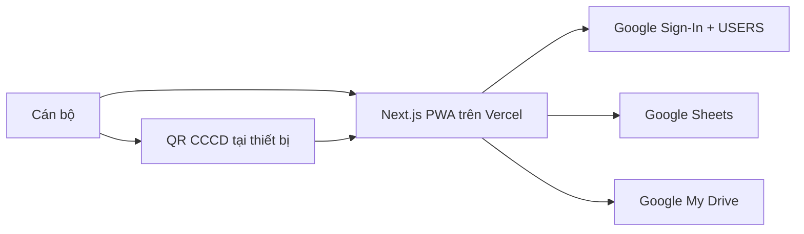

# CSDL đất đai Phường Phong Châu — Bản thử nghiệm

Web app hỗ trợ tiếp nhận, kiểm tra và theo dõi hồ sơ đất đai trong đợt 180 ngày tại Phường Phong Châu.

> Đây là hệ thống thu thập và chuẩn hóa trung gian; không thay thế cơ sở dữ liệu đất đai chuyên ngành và không tự xác nhận giá trị pháp lý của hồ sơ.

## Trạng thái

M0 đã hoàn thành: nền Next.js/PWA, module boundary, validation biến môi trường và định dạng lỗi API đã sẵn sàng. Tích hợp Google và luồng nghiệp vụ sẽ triển khai theo các mốc tiếp theo trong [PLAN.md](PLAN.md).

## Phạm vi bản thử nghiệm

- Dùng tại Phường Phong Châu, gồm 10 tổ dân phố.
- Một ảnh CCCD mặt trước và từ 1–10 ảnh GCN/bìa đỏ cho mỗi hồ sơ.
- Đọc QR CCCD ngay trên thiết bị; cán bộ xác nhận hoặc nhập tay kết quả.
- Chuyển HEIC/HEIF sang JPEG ngay trên thiết bị khi cần; PWA hoạt động online-only.
- Lưu ảnh trong Google My Drive của tài khoản quản trị.
- Lưu dữ liệu có cấu trúc, người dùng và audit log trong Google Sheets.
- Frontend và API cùng chạy trên Vercel, ưu tiên region Singapore (`sin1`).
- Chưa có OCR CCCD/GCN, Google Vision, đối soát dân cư hoặc PostgreSQL.

## Kiến trúc

Tài khoản `anmphongandn@gmail.com` sở hữu My Drive, spreadsheet, Google Cloud Project và là `SYSTEM_ADMIN` đầu tiên. Ứng dụng dùng OAuth với quyền `drive.file`; không dùng service account hoặc mật khẩu Google. Cây thư mục Drive phải được bootstrap bằng cùng OAuth client với ứng dụng, không tạo thủ công qua Drive UI.

## Tài liệu

- [Kế hoạch triển khai](PLAN.md)
- [Kiến trúc chi tiết](docs/architecture.md)
- [Chỉ dẫn cho coding agent](AGENTS.md)

## Nguyên tắc bảo mật

- Không commit `.env`, token OAuth, ảnh CCCD/GCN thật hoặc fixture chứa dữ liệu thật.
- Không tạo link Drive công khai; Drive ở chế độ `Restricted`.
- Không ghi CCCD đầy đủ, payload QR, URL upload hoặc token vào log.
- Bản thử nghiệm tối đa 500 hồ sơ. Trước khi mở rộng cần đánh giá migration sang Shared Drive/kho lưu trữ của cơ quan.
- Backup Drive trong cùng Gmail không đủ: cần export Sheets định kỳ ra nơi tách biệt và backup mã hóa ngoại tuyến.

## Khởi tạo sau khi có mã nguồn

1. Tạo Google Cloud Project và bật Google Drive API, Google Sheets API.
2. Cấu hình OAuth consent screen, redirect URI của Vercel và chuyển sang `In production` trước khi dùng dữ liệu thật.
3. Chạy bootstrap bằng OAuth client production để tạo cấu trúc My Drive, spreadsheet, `REQUEST_LOG` và dữ liệu danh mục.
4. Khai báo environment variables trên Vercel.
5. Thử nghiệm bằng dữ liệu giả trước; trước pilot dữ liệu thật, chốt cơ sở pháp lý, thời hạn lưu trữ và quy trình xử lý yêu cầu dữ liệu cá nhân.
