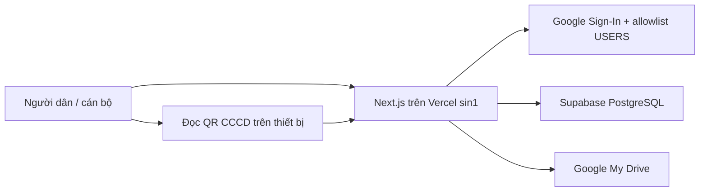

# CSDL đất đai Phường Phong Châu — Bản thử nghiệm

Web app/PWA hỗ trợ tiếp nhận, kiểm tra và theo dõi hồ sơ đất đai trong chiến dịch 180 ngày tại Phường Phong Châu. Hệ thống là công cụ thu thập và chuẩn hóa trung gian; không thay thế CSDL đất đai chuyên ngành và không tự xác nhận giá trị pháp lý của hồ sơ.

## Kiến trúc hiện tại



- Supabase PostgreSQL là kho dữ liệu cấu trúc duy nhất: hồ sơ, người dùng, idempotency, audit, timeline, chỉ mục và dữ liệu xuất.
- Google My Drive tiếp tục lưu ảnh gốc/preview và file export. Ảnh gốc upload trực tiếp từ trình duyệt bằng resumable session, không đi qua body của Vercel Function.
- Runtime không đọc/ghi Google Sheets. Spreadsheet cũ chỉ còn là nguồn migration một lần.
- `PublicIntakeRepository` và `SupabaseUserRepository` dùng PostgreSQL transaction, unique/check constraint và optimistic version update.
- Data API Supabase không được mở cho trình duyệt. Server dùng connection string bí mật; RLS bật nhưng không cấp policy cho `anon`/`authenticated`.

## Khởi tạo Supabase và chuyển dữ liệu

1. Tạo Supabase project ở Singapore và lấy URI của Supavisor transaction pooler, port `6543`.
2. Áp dụng migration trong [`supabase/migrations`](supabase/migrations). Có thể dùng Supabase CLI `supabase db push` hoặc chạy SQL qua quy trình quản trị đã phê duyệt.
3. Đặt `SUPABASE_DATABASE_URL` ở `.env.local` và Vercel. Không đặt biến này dưới tiền tố `NEXT_PUBLIC_`.
4. Sao lưu spreadsheet cũ. Giữ tạm `GOOGLE_SHEETS_SPREADSHEET_ID` chỉ trên máy chạy ETL.
5. Kiểm tra nguồn không ghi đích:

```powershell
npm run migrate:sheets-to-supabase -- --dry-run
```

6. Tạm dừng ghi trên production, chạy migration thật một lần:

```powershell
npm run migrate:sheets-to-supabase
```

7. So sánh số lượng/kiểm tra mẫu, gọi `GET /api/health/database` và `GET /api/health/google`, rồi mới deploy code dùng Supabase. ETL ghi toàn bộ dữ liệu trong một PostgreSQL transaction và tạo marker chống chạy lặp.

## Phát triển local

```powershell
npm install
npm run dev
```

Sao chép [`.env.example`](.env.example) thành `.env.local` và thay placeholder bằng secret thật. Trên PowerShell bị chặn `npm.ps1`, dùng `npm.cmd`.

Các kiểm tra chính:

```powershell
npm run typecheck
npm run lint
npm test
npm run build
```

## Phạm vi và bảo mật

- Phạm vi Phường Phong Châu, 10 tổ dân phố; web/PWA online-only.
- Mỗi cá nhân có cặp ảnh CCCD trước/sau; mỗi hồ sơ có 1–10 ảnh GCN.
- QR CCCD chỉ gợi ý dữ liệu, không lưu payload thô và không ghi đè sửa tay.
- Không commit `.env`, token, ảnh CCCD/GCN thật hoặc fixture chứa PII.
- Không tạo link Drive công khai; file ở chế độ `Restricted`.
- Mọi API write kiểm tra session/allowlist, CSRF, idempotency và quyền ở server; thao tác nhạy cảm ghi audit append-only.
- Backup Supabase phải tách khỏi Google Drive: dùng backup/PITR phù hợp gói dịch vụ và định kỳ `pg_dump` mã hóa sang nơi độc lập.

## Tài liệu

- [Kiến trúc chi tiết](docs/architecture.md)
- [Runbook test/deploy](docs/brain/05-testing-and-deploy.md)
- [Quyết định kỹ thuật](docs/brain/03-decisions.md)
- [Chỉ dẫn coding agent](AGENTS.md)
- [Roadmap hiện hành](PLAN.md)
- [Bản đồ tài liệu](docs/README.md)
- Các kế hoạch cũ và báo cáo agent nằm trong [kho lưu trữ](docs/archive/README.md), không phải nguồn chỉ dẫn hiện hành.
