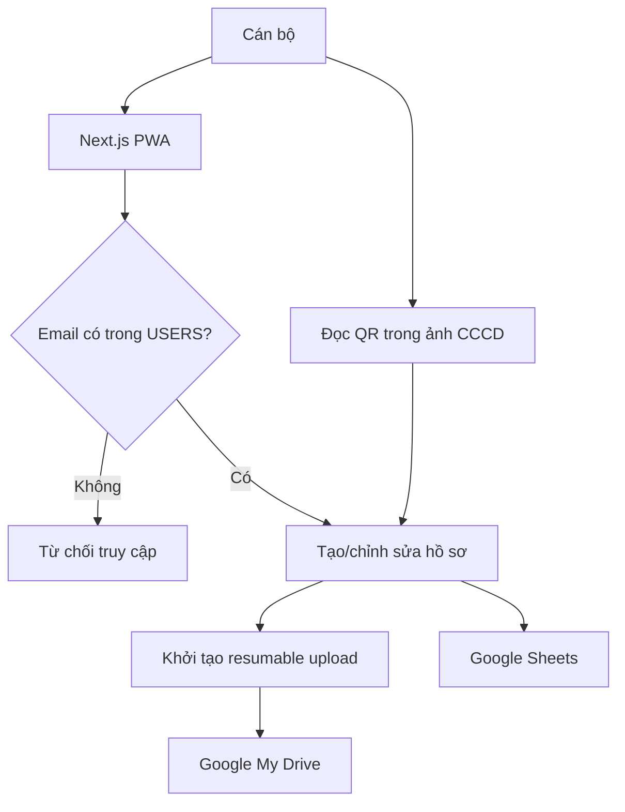

# Kiến trúc bản thử nghiệm

## Mục đích

Tài liệu này mô tả kiến trúc thử nghiệm cho hệ thống thu thập hồ sơ đất đai Phường Phong Châu. Thiết kế ưu tiên triển khai nhanh, giữ ảnh gốc và không cần OCR ở giai đoạn đầu.

Kiến trúc này là ngoại lệ có chủ đích so với phương án vận hành chính thức: dùng My Drive cá nhân của quản trị viên và Vercel. Nó không phải kiến trúc mặc định cho vận hành quy mô lớn hoặc lâu dài.

## Thành phần

| Thành phần                                 | Trách nhiệm                                                 |
| ------------------------------------------ | ----------------------------------------------------------- |
| Next.js PWA trên Vercel `sin1`             | Giao diện, xác thực, API, validation và điều phối nghiệp vụ |
| Google Sign-In                             | Xác thực danh tính cán bộ                                   |
| Google Sheets                              | Hồ sơ cấu trúc, danh mục, người dùng, chỉ mục và audit log  |
| Google My Drive                            | Ảnh gốc, preview, file export và backup                     |
| `@zxing/browser` + `heic2any`/`libheif-js` | Đọc QR CCCD và chuyển HEIC/HEIF sang JPEG tại trình duyệt   |



## Danh tính, quyền và OAuth

`anmphongandn@gmail.com` sở hữu My Drive, spreadsheet, Google Cloud Project và giữ role `SYSTEM_ADMIN` trong ứng dụng. Cán bộ đăng nhập bằng tài khoản Google riêng; quyền sử dụng hệ thống do sheet `USERS` quyết định, không dựa vào quyền Drive trực tiếp.

Hai luồng OAuth được tách biệt:

1. Đăng nhập cán bộ: `openid`, `email`, `profile`.
2. Kết nối kho dữ liệu: OAuth offline của quản trị viên, scope `drive.file`.

Refresh token chỉ được đặt trong Vercel Environment Variables và chỉ API phía server được đọc. Không dùng service account vì nó không sở hữu file trong My Drive cá nhân. Vì scope `drive.file` chỉ thấy file do app tạo, bootstrap CLI phải tạo cây thư mục Drive với cùng OAuth client production; không sử dụng folder được tạo thủ công qua Drive UI.

Bootstrap CLI tạo Drive root, các thư mục con, spreadsheet và toàn bộ tab/dữ liệu danh mục theo cách idempotent. Trạng thái cục bộ `.bootstrap-state.json` (ID) và `.bootstrap-secrets.json` (refresh token tạm thời) không được commit. `GET /api/health/google` kiểm tra OAuth, Drive root và schema Sheets nhưng không công bố ID hay liên kết nội bộ.

## Dòng dữ liệu hồ sơ

1. Cán bộ chọn tổ dân phố và tạo hồ sơ. Backend reserve case ID rồi tạo case `DRAFT`.
2. Người kê khai tạo nháp sau khi đồng ý, rồi ngay tại bước đầu chụp/chọn cặp CCCD mặt trước/mặt sau cho từng cá nhân (tối đa 10 người) và 1–10 ảnh GCN/bìa đỏ.
3. Trình duyệt kiểm tra dung lượng/định dạng, chuyển HEIC/HEIF nếu cần và thử đọc QR cục bộ từ ảnh CCCD. PWA online-only phải báo lỗi rõ ràng khi mất kết nối.
4. API khởi tạo phiên resumable upload. File gốc đi trực tiếp từ trình duyệt đến Drive; Vercel không nhận body ảnh gốc.
5. Backend xác minh metadata, dung lượng, checksum và thư mục cha của file Drive.
6. Khi có đủ cặp CCCD của từng cá nhân và tối thiểu một GCN, case chuyển sang `UPLOADED`.
7. Cán bộ kiểm tra chuyển `UPLOADED` sang `PENDING_REVIEW`, xác nhận sang `VERIFIED` hoặc yêu cầu bổ sung sang `NEEDS_MORE_DOCUMENTS`.

QR là dữ liệu gợi ý. Hệ thống không lưu payload QR thô, chỉ giữ hash/phiên bản xử lý cùng trường đã tách sau khi người kê khai xác nhận; QR không tự ghi đè dữ liệu đã sửa tay.

## Lưu trữ

```text
CSDL-DAT-DAI-PHONG-CHAU-THU-NGHIEM/
├── 00_CONFIG/
├── 01_INBOX/
├── 02_CASES/{TDP_CODE}/{CASE_ID}/
│   ├── originals/
│   └── previews/
├── 03_EXPORTS/
└── 99_BACKUP/
```

Google Sheets có các tab vận hành chính: `CASES`, `CERTIFICATES`, `OWNERS`, `FILES`, `IDENTITY_QR_SCANS`, `USERS`, `REFERENCE_DATA`, `AUDIT_LOGS`, `ID_RESERVATIONS`, `REQUEST_LOG` và `SEARCH_INDEX`. `REQUEST_LOG` lưu idempotency key cùng kết quả đã cache tối thiểu 24 giờ. Các tab mở rộng `PARCELS`, `ASSETS`, `OCR_FIELDS` được tạo sẵn nhưng chưa dùng.

Trong cổng kê khai, `PUBLIC_FILES.owner_id` gắn từng ảnh CCCD với một người; `PUBLIC_OWNERS` lưu ngày sinh, giới tính, thường trú, nguồn nhập và metadata QR đã xác nhận. Migration chỉ thêm cột, không đổi hoặc xóa dữ liệu cũ.

`file_id` nội bộ không thay đổi. `drive_file_id` là định danh hạ tầng có thể thay đổi khi migration sang Shared Drive sau này. Case ID lấy số thứ tự từ `updatedRange` của lệnh append vào `ID_RESERVATIONS`, tính năm theo `Asia/Ho_Chi_Minh`; không đọc số dòng rồi cộng một.

GCN bị xóa chỉ chuyển trạng thái `DELETED`, không hard-delete trên Drive. CCCD chỉ được thay: ảnh mới phải upload và xác minh thành công trước khi ảnh cũ chuyển `REPLACED`.

## Bảo mật và giới hạn

- Drive ở chế độ `Restricted`; không tạo link công khai hay chia sẻ thư mục gốc cho cán bộ.
- Danh sách và log che CCCD; tìm kiếm CCCD dùng HMAC ở phía server.
- Audit log append-only cho thao tác write, xem file nhạy cảm và export.
- Mọi API write dùng idempotency key; batch các ghi liên quan thay vì ghi từng ô Sheets. `version` + `409 VERSION_CONFLICT` là optimistic concurrency; rủi ro race nhỏ được chấp nhận ở pilot ≤500 hồ sơ.
- Preview tối đa 2.5 MB để có thể hiển thị qua Vercel; file gốc tối đa 30 MB và không proxy qua Vercel.
- Bản thử nghiệm tối đa 500 hồ sơ. Snapshot Drive hằng ngày trong cùng Gmail không phải backup độc lập: phải export Sheets định kỳ và lưu backup mã hóa ngoại tuyến ở nơi tách biệt.
- Trước pilot dữ liệu thật, chủ dự án phải chốt cơ sở pháp lý thu thập CCCD, thời hạn lưu trữ và quy trình xử lý yêu cầu xóa/chỉnh sửa PII.

## Cấu hình và lỗi API

- [`.env.example`](../.env.example) là danh sách biến môi trường duy nhất được commit; `.env` và mọi secret thật luôn bị loại khỏi Git.
- API phía server đọc cấu hình qua `loadServerEnvironment`; lỗi validation chỉ nêu **tên biến** sai hoặc thiếu, không trả giá trị secret.
- Mọi API route phải trả lỗi theo cấu trúc `{ error: { code, message, requestId, details } }`. `details` mặc định là `null` và không được chứa PII, token, Drive ID hay link Drive.

## Đăng nhập và phân quyền (M2)

- Auth.js/Google OAuth dùng Web OAuth Client riêng, chỉ xin `openid`, `email`, `profile`; OAuth Drive
  offline không đi qua session cán bộ.
- Session JWT dùng cookie `HttpOnly`, `SameSite=Lax`, `Secure` khi production; Google provider bắt buộc
  `state` và PKCE.
- `src/proxy.ts` chạy ở Edge, chỉ chặn session cho `/profile` và `/users`. Mỗi server page/API sau đó
  gọi `requireActiveUser()` để đọc lại `USERS` qua repository Node và kiểm tra `active`/role. Việc tách
  này khiến lệnh khóa tài khoản có hiệu lực ngay thay vì chờ JWT hết hạn.
- `GET /api/security/csrf` cấp token HMAC theo email, hết hạn sau 10 phút. `POST`/`PATCH /api/users`
  yêu cầu `x-csrf-token` và `idempotency-key`; các ghi `USERS`, `AUDIT_LOGS`, `REQUEST_LOG` đi trong
  cùng một Google Sheets `batchUpdate`.

## Cổng kê khai công khai

- `/ke-khai` gọi `POST /api/public/submissions` với một UUID v4 `idempotency-key` giữ trong phiên
  trình duyệt cho đến khi nhận được phản hồi thành công. Client tự retry một lần khi mất kết nối
  hoặc nhận lỗi 5xx; lần bấm sau tiếp tục dùng cùng key.
- Server namespace key thành `PUBLIC_CREATE:*`, dùng HMAC phía server để suy ra ổn định
  `submission_id`, mã tiếp nhận và mã bí mật. Vì vậy response đầu bị mất vẫn trả lại đúng kết quả;
  mã bí mật rõ không được ghi vào Sheets hoặc log.
- `PUBLIC_SUBMISSIONS` và `REQUEST_LOG` được append trong cùng một Sheets `batchUpdate`; các request
  chồng nhau trong cùng instance dùng chung một promise. Lỗi Google được trả theo JSON lỗi chuẩn,
  không lộ stack, PII, Drive ID hoặc token.
- Route tạo nháp có `maxDuration=30`; client chờ tối đa 35 giây vì cold request phải đọc Sheets,
  tạo cây thư mục Drive và batch ghi Google trước khi trả cookie phiên.

## Hướng nâng cấp

Khi vận hành ổn định, migration sang Shared Drive hoặc kho của cơ quan phải sao chép file, đối chiếu checksum, cập nhật `drive_file_id` và giữ nguyên `file_id`/`case_id`. Sau đó mới xem xét OCR Google Vision, dữ liệu thửa đất đầy đủ, đối soát dân cư và PostgreSQL.
