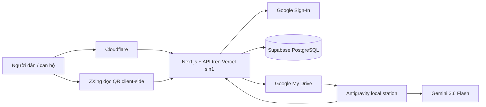

# Kiến trúc hệ thống

> Bổ sung PR #8 (2026-07-29): trong `UNDER_REVIEW`, mọi sửa PL3 đi qua
> `WorkingPayloadEditor`/`PUT /working-payload`. Server so sánh payload ứng viên với payload hiệu lực:
> sửa họ tên/CCCD/ngày sinh/giới tính sau `QR_CONFIRMED` cần lý do và thành
> `QR_OVERRIDE_PENDING_REVIEW`; sửa sau `MANUAL_COMPLETE` về `PENDING_CONFIRMATION`. Không nhận
> trạng thái/nguồn/thời điểm xác nhận do client tự gửi. GET detail cán bộ trả `files[].ownerId` chỉ để
> nhãn “CCCD chủ n – mặt trước/sau”, không mở rộng Drive ID/link.

## Tổng quan

| Thành phần                              | Trách nhiệm                                                                  |
| --------------------------------------- | ---------------------------------------------------------------------------- |
| Next.js App Router trên Vercel (`sin1`) | UI/PWA, Auth.js, Route Handlers và nghiệp vụ server                          |
| Supabase PostgreSQL (Singapore)         | Kho dữ liệu cấu trúc duy nhất, transaction, constraint, audit và idempotency |
| Google My Drive cá nhân                 | Ảnh gốc/preview và file export, luôn `Restricted`                            |
| Supavisor transaction pooler            | Kết nối PostgreSQL từ Vercel serverless, port `6543`, `prepare: false`       |
| Cloudflare/Turnstile                    | Lớp biên cho cổng công khai                                                  |

Supabase thay Google Sheets cho dữ liệu cấu trúc. Google Drive vẫn là kho file để tránh đổi đồng thời cả database và object storage. Spreadsheet cũ không được dùng trong request runtime; chỉ `scripts/migrate-sheets-to-supabase.ts` và các script legacy được phép đọc nó.

## Ranh giới module

- `src/modules/supabase/database.ts`: tạo singleton `postgres` client phía server, dùng Supavisor transaction mode (`prepare: false`, tối đa một connection mỗi instance).
- `src/modules/public-intake/repository.ts`: đọc/ghi hồ sơ công khai, file metadata, timeline, yêu cầu bổ sung, dữ liệu GCN cũ, audit, export và request log.
- `src/modules/users/supabase-user-repository.ts`: allowlist `USERS`, role, khóa/mở tài khoản, audit và idempotency.
- `src/modules/drive/*` và `src/modules/public-intake/storage.ts`: Google Drive/resumable upload.
- Component frontend và service nghiệp vụ không gọi trực tiếp PostgreSQL hoặc Google API; luôn đi qua repository.

## AI draft GCN bằng Antigravity

Khi người dân gửi đủ hồ sơ, transaction tạo job chỉ với file GCN đã xác minh và checksum.
Antigravity local station poll/claim manifest, đọc đúng ảnh GCN gốc trong Drive, dùng Gemini 3.6
Flash và trả JSON có bằng chứng. Vercel không gọi Gemini.

Server kiểm tra schema v2, model/prompt, checksum và phiên bản payload trước khi lưu result cùng
`ai_field_comparisons`/audit. Cán bộ thấy bảng đối chiếu rồi chỉ có thể nạp các trường `CLEAR` đang
trống vào working payload; AI không được ghi dữ liệu chính thức hay duyệt. Trạm đang dùng tài khoản
quản trị có rủi ro `ADMIN_BROAD_ACCESS`, nên `agent/AGENTS.md` chỉ giới hạn quy trình, không phải
rào chắn kỹ thuật tuyệt đối với CCCD. Ảnh CCCD/QR không nằm trong manifest/schema/prompt. Claim và
result bị buộc với `workerInstanceId`/lease/idempotency; server tái kiểm manifest với `PUBLIC_FILES`
và chặn JSON chứa chuỗi giống CCCD trước khi persist. Một trường `CLEAR` chỉ có thể được nạp khi
evidence trỏ tới `fileId` nằm trong manifest GCN đã xác minh; mọi kết quả `STALE` cũng được cache
trong `REQUEST_LOG` để retry cùng key trả lại đúng phản hồi.

## Mô hình dữ liệu

### Bàn làm việc PL3 đầy đủ

`PUT /api/submissions/:submissionId/working-payload` lưu nguyên tử bản làm việc đủ cột B–AX vào
`working_payload_json` và `draft_json`, đồng thời làm mới các bảng chuẩn hóa. Migration
`202607290002_full_pl3_editor.sql` bổ sung tổ chức/người đại diện, số tờ/thửa địa chính, liên kết
tài sản→thửa và các cột AO–AW; dữ liệu cũ vẫn nằm nguyên trong JSON và được đọc tương thích.

Với chủ cá nhân còn `PENDING_CONFIRMATION` hoặc `QR_OVERRIDE_PENDING_REVIEW`, cán bộ đang giữ hồ sơ
phải tích xác nhận đã đối chiếu CCCD/bản giấy tờ. `PATCH /api/submissions/:submissionId` nhận danh
sách owner ID, server kiểm đủ trường định danh, tự đóng dấu `MANUAL_COMPLETE`/thời điểm và dùng cùng
transaction `commitWorkingPayload`; audit chỉ ghi loại thao tác và số dòng, không chứa CCCD. Đây là
xác nhận thao tác của cán bộ, không phải kết luận pháp lý và không làm các điều kiện tiếp nhận khác
tự đạt.

Ba trường tự động có quy tắc rõ: B lấy mã Phường Phong Châu, V suy từ ĐVHC cũ + số tờ trên GCN,
AX lấy tên file đã xác minh/đổi tên trên Drive. Cán bộ có thể ghi đè nhưng phải nhập lý do tối thiểu
10 ký tự; audit chỉ ghi đường dẫn trường và lý do, không ghi giá trị CCCD/tên/địa chỉ trước-sau.
PL3 export dùng đúng 49 cột B–AX và không tự đổi nhãn cột của `Tai lieu/PL3.xlsx`.

Các nhóm bảng chính trong `supabase/migrations/202607230001_supabase_schema.sql`:

- Truy cập/vận hành: `users`, `audit_logs`, `request_log`, `reference_data`, `id_reservations`, `search_index`.
- Cổng công khai: `public_submissions`, `public_files`, `public_status_events`, `public_supplement_requests`, `public_supplement_items`.
- Dữ liệu chuẩn hóa: `public_certificates`, `public_owners`, `public_parcels`, `public_land_uses`, `public_assets`.
- GCN đã có: `existing_certificates`, `existing_certificate_owners`, `public_existing_record_links`, `existing_import_runs`, `public_lookup_index`.
- Hồ sơ chính thức: `cases`, `certificates`, `owners`, `files`, `identity_qr_scans`, `parcels`, `assets`, `ocr_fields`.
- Báo cáo: `export_jobs`.

`legacy_row_index` trên `public_submissions` giữ locator ổn định cho cookie phiên v2 trong giai đoạn chuyển đổi; nó không còn mang nghĩa “số dòng Sheet” trong runtime mới.

### Hàng chờ cán bộ

`GET /api/submissions` gọi `PublicIntakeRepository.listQueuePage()`: PostgreSQL thực hiện `WHERE`,
tìm kiếm, `ORDER BY updated_at DESC, submission_id DESC` và `LIMIT 101`; Node chỉ ánh xạ tối đa 100
dòng trả về. Cursor là base64url của `{updatedAt, submissionId}` đã validate và dùng keyset, nên các
hồ sơ có cùng `updated_at` không bị lẫn vị trí.

Migration `202607290004_queue_search_performance.sql` thêm generated column
`queue_owner_name`/`queue_issue_number`, index trang và trigram index cho mã tiếp nhận, số GCN, tên
chủ. Đây là projection tìm kiếm, không phải nguồn dữ liệu nghiệp vụ; nguồn vẫn là `draft_json`.
Client debounce 350 ms, không gửi tìm kiếm một ký tự và giữ bảng cũ trong lúc tải trang mới.

### Tra cứu công khai theo GCN

`POST /api/public/certificate-lookup` hỗ trợ QR CCCD và số phát hành + ngày cấp GCN. Số phát hành
được chuẩn hóa ở request layer (bỏ khoảng trắng/dấu gạch, chữ hoa) rồi repository đọc ba nguồn:
`public_certificates` của submission active, `certificates` chính thức và bản cuối `VERIFIED` trong
`existing_certificates`. Không thêm schema: các trường `issue_number`/`issue_date` hiện hữu là đủ.

Route chỉ trả `found`, trạng thái công khai `IN_PROCESSING` hoặc `OFFICIALLY_RECEIVED`, cùng hướng
dẫn cố định. Audit/rate-limit trong cùng transaction dùng HMAC nguồn gọi và fingerprint HMAC của
cặp số/ngày; không ghi số GCN hay dữ liệu cá nhân thô. Tra cứu từ wizard đi qua route session+CSRF
riêng, loại trừ chính bản nháp và không coi `REJECTED`/`EXPIRED` là hồ sơ active.

## Tính đúng đắn giao dịch

- Mọi API write có `idempotency-key` và `request_id`.
- `request_log` có primary key trên idempotency key. PostgreSQL advisory transaction lock tuần tự hóa các request cùng key.
- Một transaction ghi đồng thời bản ghi nghiệp vụ, timeline/audit, yêu cầu bổ sung và kết quả idempotency. Cùng key/cùng payload trả lại kết quả; cùng key/khác payload trả `409 IDEMPOTENCY_CONFLICT`.
- Update có điều kiện `WHERE version = expectedVersion`; không khớp trả `409 VERSION_CONFLICT`.
- Unique partial index chặn hai ảnh CCCD cùng mặt đang `UPLOADED` cho cùng người. Ảnh mới phải xác minh trước, sau đó ảnh cũ chuyển `REPLACED` trong transaction.
- Dữ liệu GCN cũ append-only; reader chọn `row_version` mới nhất cho mỗi `existing_record_id`.
- Cache miss khi tạo thư mục Drive được tuần tự hóa bằng `pg_advisory_xact_lock` theo `(parentId, name)`
  trong một transaction riêng; cache bộ nhớ chỉ là tối ưu, không phải khóa xuyên lambda.
- Một lần điều chỉnh hồ sơ đã tiếp nhận cập nhật `official_payload_*` cùng transaction với
  `draft_json` và các bảng chính thức, nên snapshot hiệu lực không thể cũ hơn dữ liệu chuẩn hóa.

## Xác thực, phân quyền và RLS

Google Sign-In chỉ cấp session. Mỗi request bảo vệ đọc lại `users` từ Supabase, nên khóa tài khoản có hiệu lực ngay và role trong JWT không được coi là nguồn quyền.

Ứng dụng không dùng Supabase Auth/Data API cho client. RLS được bật trên mọi bảng, không có policy cho `anon`/`authenticated`, và quyền bảng/sequence của hai role này bị thu hồi. `SUPABASE_DATABASE_URL` chỉ tồn tại phía server/Vercel.

## File và upload

1. Browser kiểm tra JPEG/PNG/WebP/HEIC/HEIF, tối đa 30 MB; HEIC/HEIF chuyển JPEG client-side khi
   cần. Trên Preview và Production, `NEXT_PUBLIC_INTAKE_IMAGE_NORMALIZATION_ENABLED=true` từ
   2026-07-29: CCCD tối đa 2400 px, GCN tối đa 3000 px, JPEG quality 0.88. Drive lưu bản tiếp nhận
   vận hành đã chuẩn hóa; metadata nguồn/đích được lưu nhưng byte camera không được tải lên.
2. API tạo resumable upload session trong Google Drive.
3. Browser PUT trực tiếp lên Drive và hiển thị tiến độ/retry.
4. API complete xác minh folder cha, MIME, dung lượng và checksum.
5. Metadata file được ghi vào Supabase; Drive ID/link không được trả trong lỗi hoặc log kỹ thuật.

Google My Drive tiếp tục dùng cây `00_CONFIG`, `01_INBOX`, `02_CASES`, `03_EXPORTS`, `99_BACKUP`. Scope vẫn là `drive.file`; không dùng service account hoặc link công khai.

## Cổng kê khai công khai

Tạo nháp và gửi chính thức dùng UUID v4 idempotency key. `PUBLIC_CREATE:*` suy ra ổn định submission ID, mã tiếp nhận và mã bí mật bằng HMAC; secret rõ không được lưu. `PUBLIC_SUBMIT:*` ghi trạng thái, draft chuẩn hóa, audit, timeline, chỉ mục HMAC và request log trong một transaction, nên response bị mất vẫn replay đúng kết quả.

Mỗi API write kiểm tra CSRF và quyền ở server. Turnstile/Cloudflare fail-closed cho bề mặt công khai; PII, QR raw, token, Drive ID/link và CCCD đầy đủ không được ghi log.

`/ke-khai-ho` gửi qua route staff riêng, bắt buộc `ASSISTED_INTAKE_ROLES` + staff CSRF và không
Turnstile. Upload complete replay request log trước validation trạng thái mới; mọi cleanup xác minh
orphan trước khi xóa. Official acceptance chặn consent/identity chưa xác nhận; lỗi chặn cho cán bộ
trả danh sách `code`/`label`/`message` an toàn để chỉ rõ mục cần hoàn thiện, không trả PII. Timeline
public chỉ trả DTO allowlist và sanitize email ở cả write/read.

## Migration và cutover

1. Tạo project Supabase Singapore; áp dụng toàn bộ SQL migration.
2. Backup spreadsheet và chặn ghi trong cửa sổ cutover.
3. Chạy `npm run migrate:sheets-to-supabase -- --dry-run`.
4. Chạy ETL thật. Script đọc trước toàn bộ tab, sau đó insert trong một PostgreSQL transaction; lỗi bất kỳ làm rollback toàn bộ.
5. ETL đổi kiểu/đổi tên cột, giữ `legacy_row_index`, đồng bộ identity sequence sau khi chèn giá trị legacy, chuẩn hóa nháp JSON lồng nếu phát hiện sau cutover, dựng lại chỉ mục GCN từ `EXISTING_CERTIFICATE_OWNERS`, và ghi marker `LEGACY_SHEETS_IMPORT:*` chống nhập lặp.
6. Đối chiếu row count và mẫu hồ sơ/file/audit; gọi hai health endpoint; deploy code; giữ Sheet ở chế độ chỉ đọc trong thời gian rollback đã chốt.

Không chạy ETL khi production còn ghi. Không xóa spreadsheet sau cutover; giữ bản restricted theo chính sách lưu trữ/rollback.

## Health, backup và phục hồi

- `GET /api/health/database`: kết nối PostgreSQL và xác nhận schema tối thiểu.
- `GET /api/health/google`: OAuth Drive, root folder và dung lượng; không còn kiểm tra Sheets.
- Dùng backup hằng ngày/PITR theo gói Supabase. Ngoài ra phải có `pg_dump` mã hóa định kỳ lưu ở nơi độc lập với Supabase và Gmail.
- Snapshot Drive trong cùng Gmail không phải backup độc lập. Phải có bản sao mã hóa ngoài tài khoản chủ quản và diễn tập restore.

## Hướng nâng cấp

Shared Drive/kho lưu trữ cơ quan vẫn là nâng cấp riêng. Khi chuyển file, giữ nguyên `file_id`/`case_id`, cập nhật `drive_file_id`, kiểm checksum và audit theo lô. OCR CCCD, đối soát dân cư và tích hợp CSDL đất đai chỉ triển khai khi có cơ sở pháp lý và kênh kỹ thuật chính thức.
# Cập nhật Phase 2 — chi tiết cán bộ và xem ảnh theo yêu cầu

`/submissions/:submissionId` kiểm quyền và server-prime DTO chi tiết trước khi render client. Initial render không gọi lại `GET /api/submissions/:submissionId`; endpoint này vẫn giữ cho refresh sau thao tác ghi. `DocumentViewer` không đặt `src` ảnh trước hành động “Xem ảnh”; preview route xác minh đúng một file `UPLOADED` thuộc submission bằng repository trước khi gọi Drive. AI draft chỉ tải khi cán bộ mở phần đối chiếu. Detail/preview response thành công có `Server-Timing` không chứa PII.
