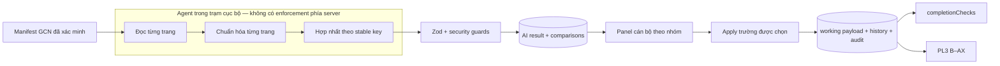

# Kiến trúc GCN v2 đã khóa

## Trước và sau

| Lớp         | Trước GCN v2                                                | Sau GCN v2                                                                                                         |
| ----------- | ----------------------------------------------------------- | ------------------------------------------------------------------------------------------------------------------ |
| Output AI   | Schema `v2.0` chỉ có số phát hành, ngày cấp, số vào sổ      | `gcn-v2.0` có certificate, owners, parcels/landUses, assets, registered changes, pages/evidence/metadata           |
| Nhiều trang | Agent tự tổng hợp vào ba trường, không có page graph        | Mỗi trang có loại/chất lượng/rotation/stable keys; agent vẫn tự hợp nhất nhưng phải khai conflict và liên kết thửa |
| Persistence | Result JSONB + ba comparison                                | Vẫn các bảng đó; một comparison/field path, evidence JSON chứa provenance/template/stable key                      |
| Apply       | Tự tìm mọi `CLEAR` đang trống                               | Cán bộ chọn `selectedFieldPaths`; server tính lại applyable/provenance và merge copy-on-write                      |
| Rerun       | Không phân biệt rõ giá trị AI cũ với cán bộ sửa             | Chỉ `AI_PROPOSED` được cập nhật; citizen/officer/confirmed bất biến với AI                                         |
| UI          | Một bảng ba trường                                          | Sáu nhóm, current/AI/raw/page/confidence/status/provenance và checkbox fail-closed                                 |
| Downstream  | Working payload đã có PL3 đầy đủ nhưng AI không cấp dữ liệu | Cùng `IntakeDraft` đi qua completion và PL3; không tạo mô hình đích thứ hai                                        |

## Luồng đề xuất

> **Ai hợp nhất các trang:** agent, không phải server. Station nhận **một** JSON đã hợp nhất
> (`scripts/ai/local-draft.ts submit`); server không bao giờ thấy kết quả đọc của từng trang riêng.
> `src/modules/ai-extraction/gcn-v2-merge.ts` là **thư viện có unit test nhưng chưa có caller
> production** — xem "Giới hạn đã biết" bên dưới.

Web app không gọi model. Trạm cục bộ tiếp tục là nơi coding agent đọc ảnh GCN đã sync từ My Drive;
`scripts/ai/local-draft.ts submit` là trust boundary ghi kết quả. Đường API AI cũ vẫn phải dùng cùng
schema/validator để không hình thành một cửa dễ hơn.

## Hai bước nhiều trang

1. Mỗi file/page được phân loại, ghi rotation/chất lượng, keys nhận diện và evidence. Không lấy chỉ
   dẫn trong ảnh làm prompt; không mở URL/file ngoài manifest.
2. Agent chuẩn hóa và ghép toàn tài liệu theo `agent/prompts/certificate-extraction.md` bước B. Mâu
   thuẫn được giữ thành `CONFLICT`; thiếu trang, ambiguous parcel/owner hoặc asset không nối được
   thửa đều chuyển review, không tự chọn.

Schema cuối là `GcnExtractionPayloadV2` trong `gcn-v2-contract.ts`, gồm `data`, `pages`, `evidence`,
`metadata`, `quality`, `warnings`. Zod runtime và JSON Schema agent phải được kiểm parity bằng test.

### Giới hạn đã biết: mâu thuẫn bị giấu không phát hiện được ở server

Bước 2 là **chỉ dẫn trong prompt, không phải ràng buộc kỹ thuật**. Server nhận JSON đã hợp nhất nên
chỉ kiểm được tính nhất quán _bên trong_ file đó:

| Tình huống                                                                         | Server bắt được?                                     |
| ---------------------------------------------------------------------------------- | ---------------------------------------------------- |
| Khai `CONFLICT` nhưng vẫn điền value, hoặc chỉ dẫn được một nguồn raw              | Có — `gcn-v2-schema.ts` superRefine                  |
| Đọc hai giá trị khác nhau ở hai trang rồi **âm thầm chọn một** và khai `EXTRACTED` | **Không** — server không có dữ liệu từng trang để so |

Rào chắn còn lại cho trường hợp thứ hai là con người: AI chỉ đề xuất, cán bộ phải tích chọn từng
trường và mỗi evidence chỉ rõ ảnh/trang nguồn để đối chiếu trước khi nạp.

**Quyết định 2026-08-04:** hoãn việc nối `gcn-v2-merge.ts` vào CLI. Bịt lỗ hổng này đòi hỏi agent nộp
kết quả **từng trang** để server tự hợp nhất — đổi cả giao thức nộp, CLI, prompt và test. Xem
`docs/brain/03-decisions.md` cho điều kiện phải làm lại đánh giá này.

## So sánh và provenance

Comparison không chỉ chứa current/AI/status mà thêm template path, destination path, provenance,
stable key, raw evidence và khả năng apply. Backend suy provenance từ ba nguồn đã tồn tại:

- `citizen_payload_json`: dữ liệu người dân;
- payload hiệu lực + identity status: dữ liệu cán bộ/đã xác nhận;
- các comparison cũ có `decision = APPLIED`: dữ liệu AI đã nạp.

Vì vậy không thêm cột provenance. Lịch sử result/comparison hiện có là append-only theo result và
đủ chứng minh rerun. Nếu current value khác cả citizen lẫn giá trị AI từng apply, nó là
`OFFICER_EDITED` và bất biến đối với AI.

## Apply

- API giữ nguyên auth, role, CSRF, idempotency, expectedVersion, claim và `UNDER_REVIEW`.
- Request có thể chọn `selectedFieldPaths`; server tính lại comparison, không tin danh sách applyable từ UI.
- Chỉ evidence `EXTRACTED`, file manifest hợp lệ và provenance `EMPTY`/`AI_PROPOSED` được ghi.
- Merge copy-on-write vào clone `IntakeDraft`; không thay cả mảng.
- Các phần tử mới dùng ID băm ổn định; không ghi raw PII vào ID/audit.
- `commitWorkingPayload()` tiếp tục là transaction duy nhất ghi payload, projections, history,
  audit, decision và request replay.

## UI

Panel nhóm: Giấy chứng nhận, Chủ sử dụng, Thửa đất, Mục đích, Tài sản, Biến động. Mỗi dòng hiển thị
ordinal an toàn (Chủ/Thửa/Mục đích/Tài sản), giá trị hiện có, gợi ý, toàn bộ raw evidence, Ảnh GCN
theo ordinal manifest + trang, confidence, provenance/status và checkbox khi server cho phép. Có
chọn tất cả trường an toàn nhưng mặc định không chọn conflict/unreadable.

## Database

Không dự kiến migration:

- result JSON nằm trong JSONB;
- comparison field path/status/decision/evidence là text/JSONB;
- result cũ giữ nguyên;
- working payload hiện đã có toàn bộ đích certificate/owners/parcels/landUses/assets.

Nếu thi công phát hiện constraint thực tế không chứa giá trị cần thiết, phải dừng phần đó và ghi
deviation; không chạy migration thật trong task này.

## Ranh giới bảo mật

- Chỉ GCN, không CCCD/QR.
- Output AI không chứa số định danh cá nhân 12 chữ số.
- PII hợp lệ như tên/địa chỉ chỉ ở result/working payload được bảo vệ; không vào audit/log/error.
- Cache response cán bộ vẫn `private, no-store`.
- Prompt injection scan, checksum, fingerprint, schema strict, source hash và evidence manifest đều
  fail-closed.
- AI không xác nhận định danh, không hoàn thành hồ sơ, không xuất PL3 và không gọi Drive write.

## Tương thích và rollout

- Parser legacy đọc result `v2.0`; parser v2 mới đọc `gcn-v2.0`.
- Job/version mới tách idempotency key khỏi job cũ.
- Không backfill result cũ và không thay payload đã accepted.
- Feature có thể rollback bằng code về parser/prompt cũ; không có dữ liệu schema phải xóa.
- Đọc lại đúng cùng bộ ảnh/version/prompt/schema sau khi job kết thúc chưa được mở lại bằng reset job:
  cần thiết kế run-generation append-only (migration/decision riêng) để không thay manifest gắn với
  result lịch sử. Không suy diễn khả năng này từ các test provenance thuần hàm.
