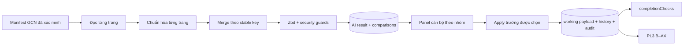

# Kiến trúc GCN v2 đã khóa

## Luồng đề xuất

Web app không gọi model. Trạm cục bộ tiếp tục là nơi coding agent đọc ảnh GCN đã sync từ My Drive;
`scripts/ai/local-draft.ts submit` là trust boundary ghi kết quả. Đường API AI cũ vẫn phải dùng cùng
schema/validator để không hình thành một cửa dễ hơn.

## Hai bước nhiều trang

1. Mỗi file/page được phân loại, ghi rotation/chất lượng, keys nhận diện và evidence. Không lấy chỉ
   dẫn trong ảnh làm prompt; không mở URL/file ngoài manifest.
2. Merger chuẩn hóa và ghép toàn tài liệu. Mâu thuẫn được giữ thành `CONFLICT`; thiếu trang,
   ambiguous parcel/owner hoặc asset không nối được thửa đều chuyển review, không tự chọn.

Schema cuối là `GcnExtractionPayloadV2` trong `gcn-v2-contract.ts`, gồm `data`, `pages`, `evidence`,
`metadata`, `quality`, `warnings`. Zod runtime và JSON Schema agent phải được kiểm parity bằng test.

## So sánh và provenance

Comparison không chỉ chứa current/AI/status mà thêm template path, destination path, provenance,
stable key, raw evidence và khả năng apply. Backend suy provenance từ ba nguồn đã tồn tại:

- `citizen_payload_json`: dữ liệu người dân;
- payload hiệu lực + identity status: dữ liệu cán bộ/đã xác nhận;
- các comparison cũ có `decision = APPLIED`: dữ liệu AI đã nạp.

Vì vậy không thêm cột provenance. Lịch sử result/comparison hiện có là append-only theo result và
đủ chứng minh rerun. Nếu current value khác cả citizen lẫn giá trị AI từng apply, nó là
`OFFICER_EDITED` và bất biến đối với AI.

## Apply

- API giữ nguyên auth, role, CSRF, idempotency, expectedVersion, claim và `UNDER_REVIEW`.
- Request có thể chọn `fieldPaths`; server tính lại comparison, không tin danh sách applyable từ UI.
- Chỉ evidence `EXTRACTED`, file manifest hợp lệ và provenance `EMPTY`/`AI_PROPOSED` được ghi.
- Merge copy-on-write vào clone `IntakeDraft`; không thay cả mảng.
- Các phần tử mới dùng ID băm ổn định; không ghi raw PII vào ID/audit.
- `commitWorkingPayload()` tiếp tục là transaction duy nhất ghi payload, projections, history,
  audit, decision và request replay.

## UI

Panel nhóm: Giấy chứng nhận, Chủ sử dụng, Thửa đất, Mục đích, Tài sản, Biến động. Mỗi dòng hiển thị
giá trị hiện có, gợi ý, raw evidence rút gọn, trang, confidence, provenance/status và checkbox khi
server cho phép. Có chọn tất cả trường an toàn nhưng mặc định không chọn conflict/unreadable.

## Database

Không dự kiến migration:

- result JSON nằm trong JSONB;
- comparison field path/status/decision/evidence là text/JSONB;
- result cũ giữ nguyên;
- working payload hiện đã có toàn bộ đích certificate/owners/parcels/landUses/assets.

Nếu thi công phát hiện constraint thực tế không chứa giá trị cần thiết, phải dừng phần đó và ghi
deviation; không chạy migration thật trong task này.

## Ranh giới bảo mật

- Chỉ GCN, không CCCD/QR.
- Output AI không chứa số định danh cá nhân 12 chữ số.
- PII hợp lệ như tên/địa chỉ chỉ ở result/working payload được bảo vệ; không vào audit/log/error.
- Cache response cán bộ vẫn `private, no-store`.
- Prompt injection scan, checksum, fingerprint, schema strict, source hash và evidence manifest đều
  fail-closed.
- AI không xác nhận định danh, không hoàn thành hồ sơ, không xuất PL3 và không gọi Drive write.

## Tương thích và rollout

- Parser legacy đọc result `v2.0`; parser v2 mới đọc `gcn-v2.0`.
- Job/version mới tách idempotency key khỏi job cũ.
- Không backfill result cũ và không thay payload đã accepted.
- Feature có thể rollback bằng code về parser/prompt cũ; không có dữ liệu schema phải xóa.
